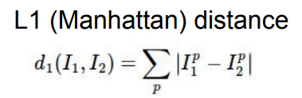
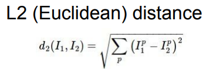
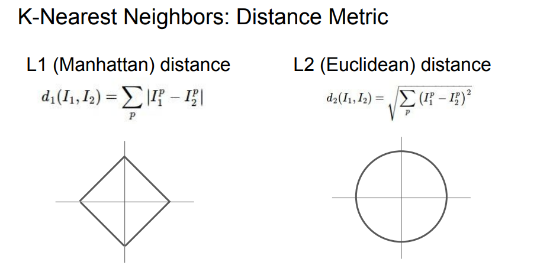
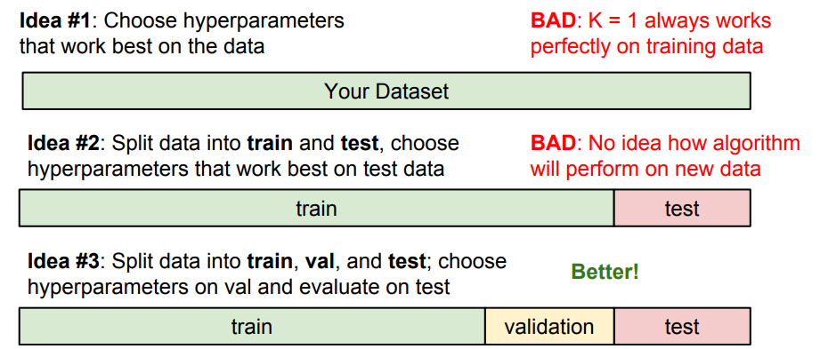
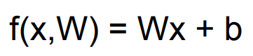
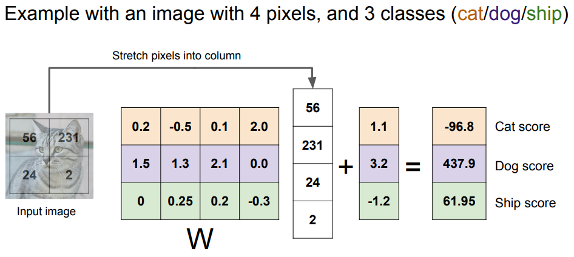
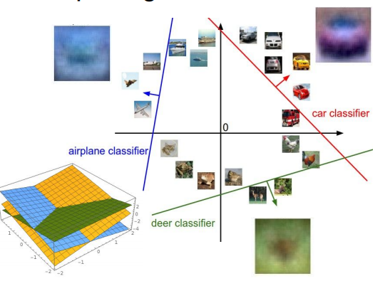
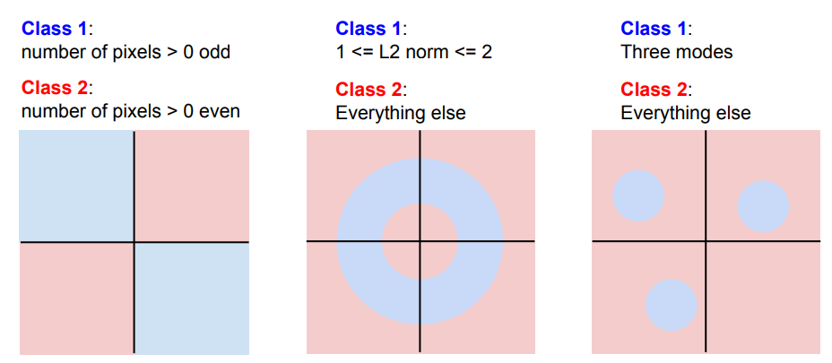

CS231n的Lecture-2，主要讲授图像分类的需求和数据集，以及ML领域的图像分类算法:近邻算法以及近邻算法的升级版本，KNN和线性分类器；并且介绍了超参数的概念和工程中常用的拆分数据集的经验
<!--more-->
## image classification

**A core task in CV**

对于计算机来说，图片是一个巨大的多维数字矩阵，这导致从其中提取特征很困难。

## Semantic Gap(语义鸿沟)
> Semantic Gap(语义鸿沟): 图片的语义标签和计算机中的像素值之间的巨大差距
> 
challenge：
1. viewpoint variation,每个像素的数值会随着视角变换而变化
2. illumination,光线的变化
3. deformation,可变性的物体会有不同的姿势和位置
4. occlusion,遮挡的问题
5. background clutter,背景混乱的问题，物体的颜色和纹理可能会与背景颜色很相像
6. intraclass variation,同类的内部差异

## Data-Driven Approach
1. 收集有图像和标签的数据集
2. 使用机器学习算法训练分类器
3. 使用分类模型对新图像进行分类

基础的两个函数：训练和预测

## Nearest Neighbor
### Train
几乎不做任何事情，单纯的记住数据和标签
### predict
输入新图片，找到最类似的

### 数据集：CIFAR10
10类  
50000 训练图片  
10000 测试图片

### Distance Metric: L1 distance/Manhattan distance
 

简单来说就是测试值和训练值的像素差的绝对值的和

### 最近邻代码
```python
import numpy as np

class NearestNeighbor(object):
  def __init__(self):
    pass

  def train(self, X, y):
    """ X is N x D where each row is an example. Y is 1-dimension of size N """
    # the nearest neighbor classifier simply remembers all the training data
    self.Xtr = X
    self.ytr = y

  def predict(self, X):
    """ X is N x D where each row is an example we wish to predict label for """
    num_test = X.shape[0]
    # lets make sure that the output type matches the input type
    Ypred = np.zeros(num_test, dtype = self.ytr.dtype)

    # loop over all test rows
    for i in xrange(num_test):
      # find the nearest training image to the i'th test image
      # using the L1 distance (sum of absolute value differences)
      distances = np.sum(np.abs(self.Xtr - X[i,:]), axis = 1)
      min_index = np.argmin(distances) # get the index with smallest distance
      Ypred[i] = self.ytr[min_index] # predict the label of the nearest example

    return Ypred
```

L1 distance:  
np.sum(np.abs(按位取差), axis=1)

### 近邻算法的效率
train O(1)  
predict O(N)

这是不能接受的  
在工程中，可以接受训练时间slow，但是预测时间必须fast


## K-Nearest Neighbors(KNN)

不只是寻找最近的点，根据距离度量，寻找到距离最近的K个点(通过多数投票majorty vote的方式)

随着K值的变大，分类的边界会变得更平滑

### Distance Metric: L2 distance/Euclidean distance
 

简单来说就是平方和的平方根

### L1 & L2
 

两种距离公式的使用场景有一个重要的差别在于，L2是对某点的等量距离取值，也就是说没有特殊性，取值不会随着坐标轴的变化而变化；  
而L1相对来说适用于特征向量中一些特殊的值

### 超参数 Hyperparameters
> Hyperparameters:choices about the algorithm that we set rather than learn

超参数无法从数据中学习出来，需要提前设定好  

超参数的设定，目前的办法一般是：多尝试。。。。。 - -！

### 拆分数据集（为了交叉验证）


设定超参需要验证，需要将数据集拆分成三份，一份训练，一份验证还有一份测试(这与我之前的做法有一些出入)  
由于需要验证算法和超参在**新数据**上的表现是否最佳，如果只将数据拆成两份(train&test)，那么找出的超参很可能只是适用于此组测试数据(而非新数据)的

## Linear Classification



### parametric model

线性分类器是最简单的参数模型(parametric model)  
参数模型通常函数主要的两部分：
1. x : 输入数据
2. W : 参数(权重)

与K近邻不同的重要一点在于，线性分类器没有保存所有的信息，而是将训练过程中获得的"知识(W)"保留了下来

最简单的线性分类器例子:W与x相乘



### Interpreting LinearClassifier
可以这样理解线性分类器：  
其实就是在空间中，使用线将类别划分出来



### Hardcases for linearclassifier
正由于线性分类器这样的特征，有一些情况线性分类器无法解决

如：异或问题，多分类问题等  




[slides](http://cs231n.stanford.edu/slides/2017/cs231n_2017_lecture2.pdf)