CS231n的Lecture-3，主要讲授损失函数和优化，介绍了SVM和softmax损失函数；以及为了防止过拟合的正则化方法；阐述了梯度的概念，并且引入了梯度下降法和随机梯度下降(SGD)
<!--more-->

##  loss function
 简单理解就是衡量W的好坏的函数

 损失函数的通用公式：  
 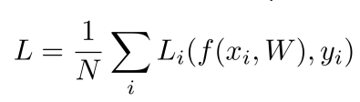

 x : 图片(输入数据)  
 y : 标签(输出结果)，通常是个表示标签的整数

 损失函数计算所有样本损失的平均

 ### Multiclass SVM loss

公式：  
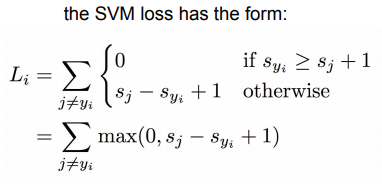

 详解一个多分类ＳＶＭ的计算过程：

首先问题是判断３张图片的分类，目前我们的算法得到了一些结果，我们由这些数据来进行loss func的计算　　

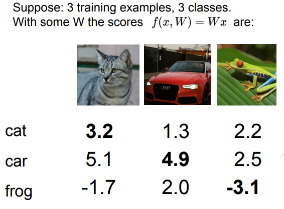

从图像来看，这个函数是个合页损失函数(Hinge loss)，因为在达到一定阈值之后，损失会变成０

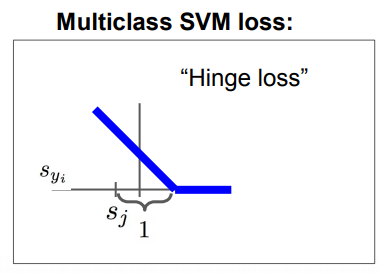

对第一个样本进行损失计算：　
　
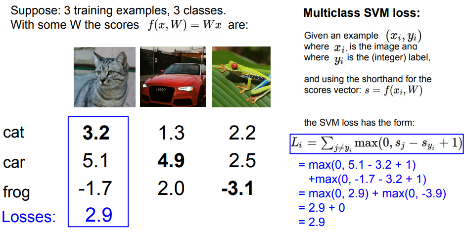

对第二个样本进行损失计算：　　

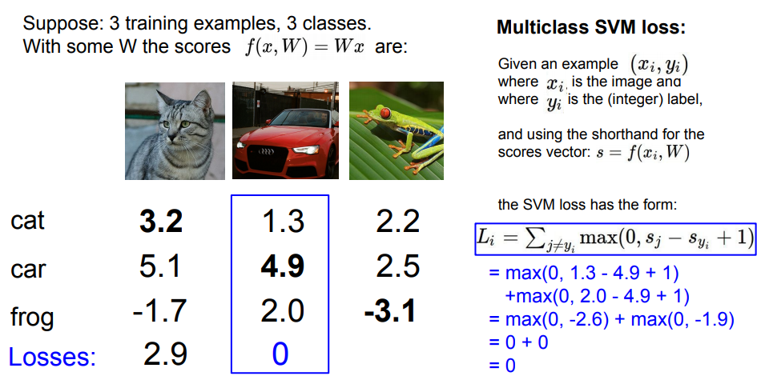

对第三个样本进行损失计算：　　

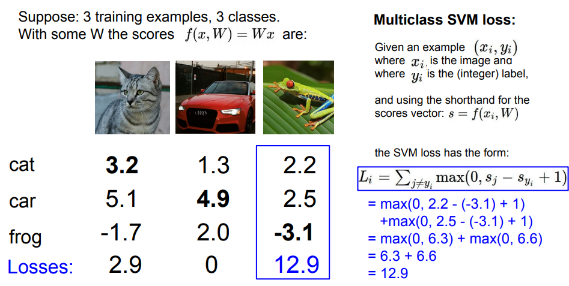

最后计算总的损失：

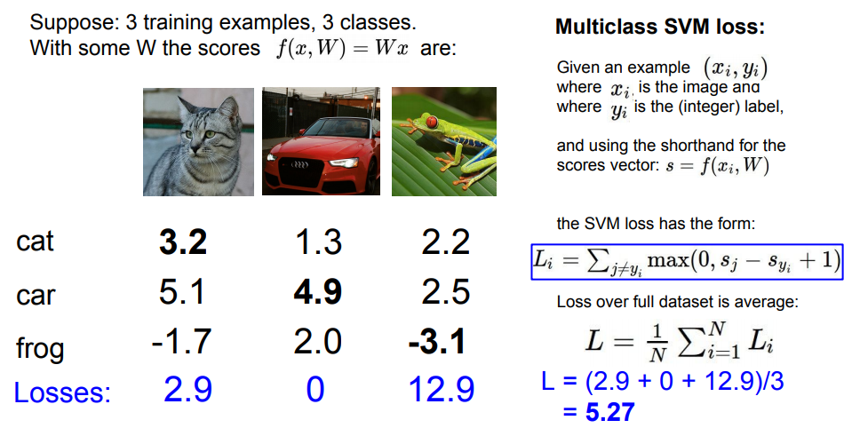

### Regularization
为了防止过拟合，需要添加正则化项:  
换句话说是减轻模型的复杂程度，避免过度拟合数据　　

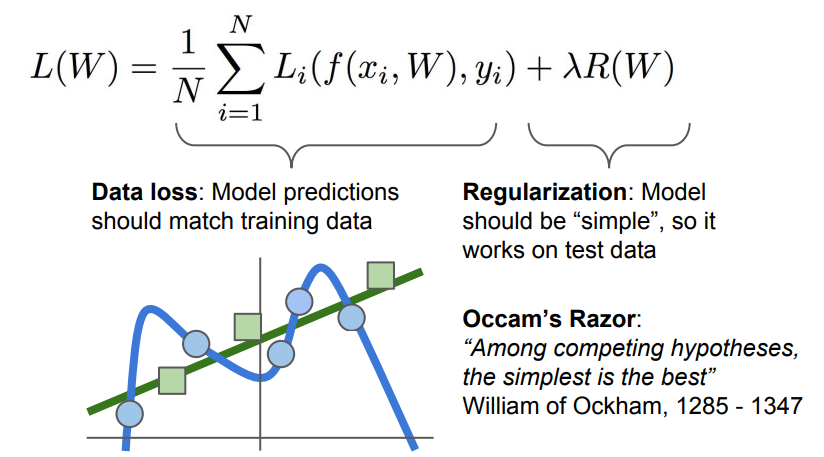

这是一些常用的正则化方法:
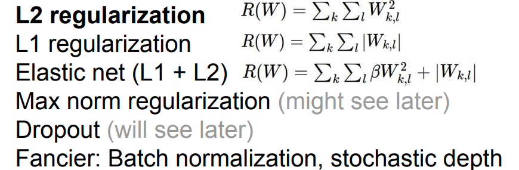


 ### Softmax Classifier (Multinomial Logistic Regression)

在SVM中，我们得到的结果Ｙ通常是没有什么含义的。在softmax中，将会赋予这些输出结果一些含义。

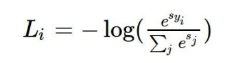

之所以使用log是因为，log是一个单调升的函数，通过log处理之后可以方便找出最接近１的结果。　　

又由于损失函数是计算算法损失的，所有对于正确性来说我们在公式中加上了负号。　　

一个计算过程：　　

输出结果Ｙ经过exp(目的是转换为正值)处理，在通过归一化(使他们成为和为１的概率)

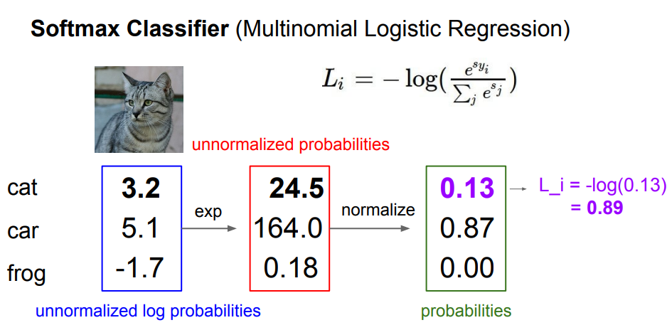

## Optimization

### gradient

一维数据的梯度就是导数：
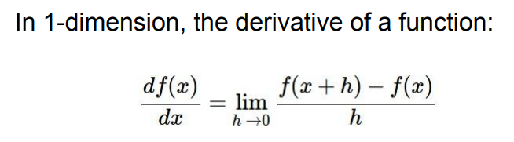

对于多维数据(高位矩阵)每一位的偏导组成的向量就是梯度

梯度与原始的x(vector)有着相同的shape  

每一位的梯度的含义是在此点上函数的斜率

所以通过这种方法可以找到指向函数增长最快的方向  

所以负的梯度值就指向了函数下降最快的方向  

所以函数从整体上看每个位置的斜率就可以通过梯度和该点的向量的点积(dot product)进行计算


### Numerical gradient & Analytic gradient

常使用解析梯度而非数值梯度(因为计算繁琐)

但是可以使用数值梯度进行检查

### Gradient Descent

简单来说，就是随机设定一个W，然后计算损失和梯度，然后向梯度的反方向对W进行调整(利用每一步的梯度，决定下一步的方向)

步长(学习率，learning rate)是个超参数  

```python
# Vanilla Gradient Descent

while True:
  weights_grad = evaluate_gradient(loss_fun, data, weights)
  weights += - step_size * weights_grad # perform parameter update

```

### Stochastic Gradient Descent (SGD)

当样本量N极大时，使用随机梯度下降可以显著减少计算量  

随机梯度使用小批量样本进行计算(minibatch),然后根据在此小批量样本上计算出的结果估计整体的误差和梯度

```python
# Vanilla Minibatch Gradient Descent

while True:
  data_batch = sample_training_data(data, 256) # sample 256 examples
  weights_grad = evaluate_gradient(loss_fun, data_batch, weights)
  weights += - step_size * weights_grad # perform parameter update
```

[slide](http://cs231n.stanford.edu/slides/2017/cs231n_2017_lecture3.pdf)