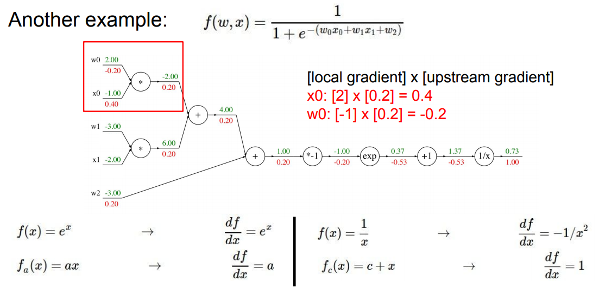
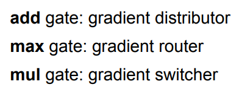
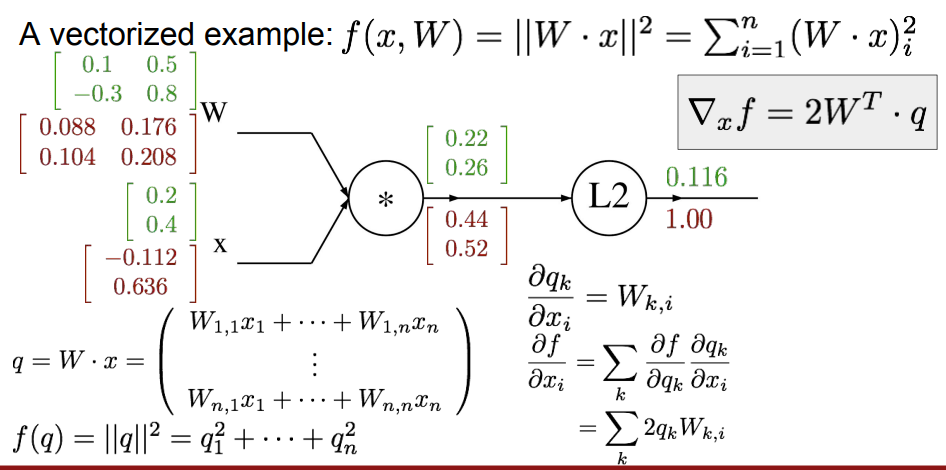
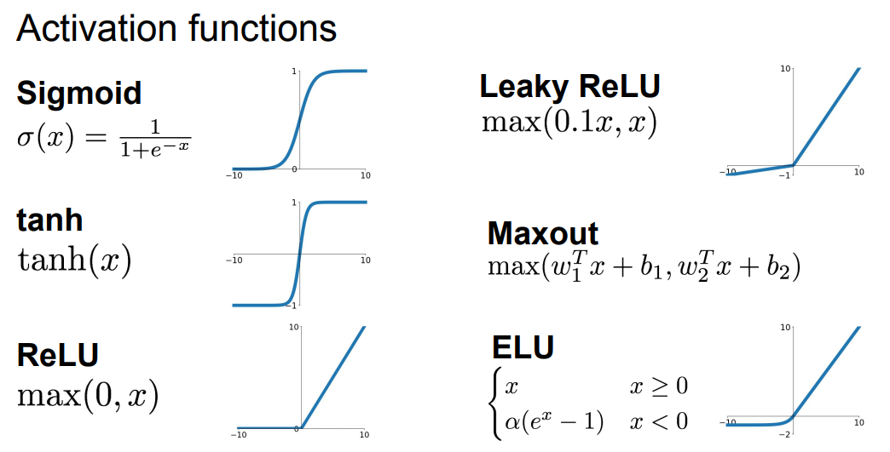

Lecture-4首先介绍了计算图模型的概念，可以用来直观感受计算过程，课程的很长时间都在详细解读反向传播的计算过程(由此可见这是DL的非常重点的知识)；

第二部分主要介绍了神经网络的概念并且初步引入了一些经常使用的激活函数
<!--more-->
## Computational graphs
课程这里介绍了计算图的概念，使用计算图可以更加直观的解析复杂的运算。

## Backpropagation

>反向传播 : 递归的使用链式法则计算计算图中任意节点的梯度

课堂上详细介绍了一个标量的反向传播逐步计算的例子：

在计算图中有一些模式被总结出来：

> Jacobian matrix : 对输入向量的每个元素分别求偏导的结果 

由于Jacobian matrix是对角矩阵(diagonal matrix),所以不需要计算整个矩阵

一个向量的反向传播的例子：

需要注意的点:
1. 向量的梯度总是与原向量的size相同
2. 每个梯度的元素代表着这个元素对最终函数影响的大小

## Neural Networks

神经网络是又简单函数构成的一组函数，在顶层堆叠在一起形成一个复杂的非线性函数，是一个对阶段分层计算

### activation function

[2018 slide](http://cs231n.stanford.edu/slides/2018/cs231n_2018_lectureCS231n-Lecture-4-Backpropagation-and-Neural-Networks-反向传播和神经网络.pdf)

[2017 slide](http://cs231n.stanford.edu/slides/2017/cs231n_2017_lecture4.pdf)