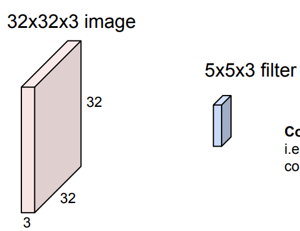
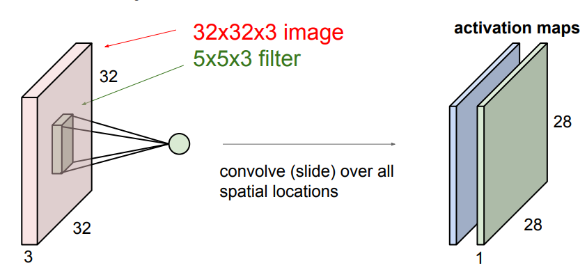
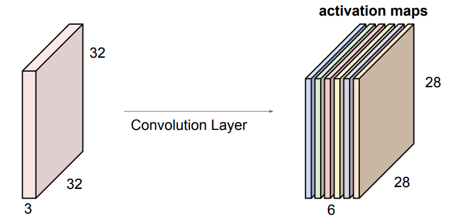
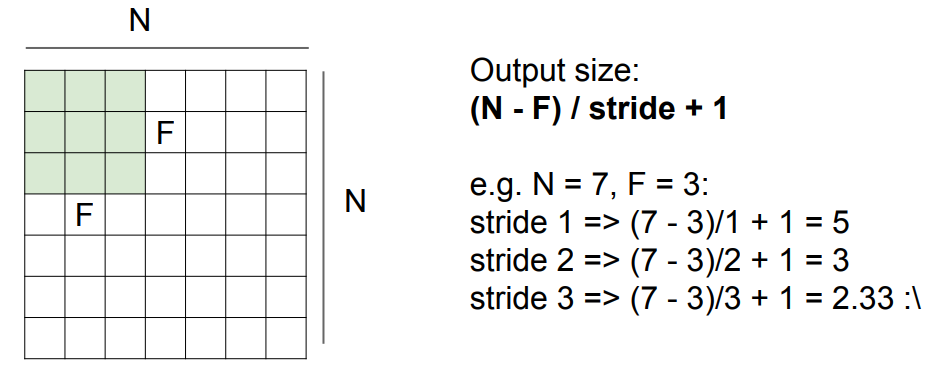
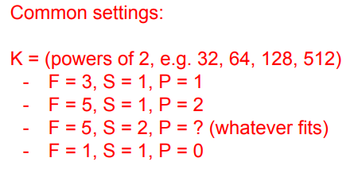
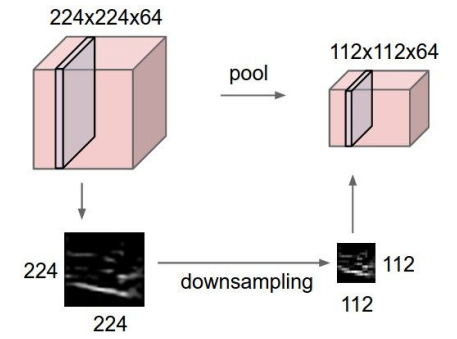
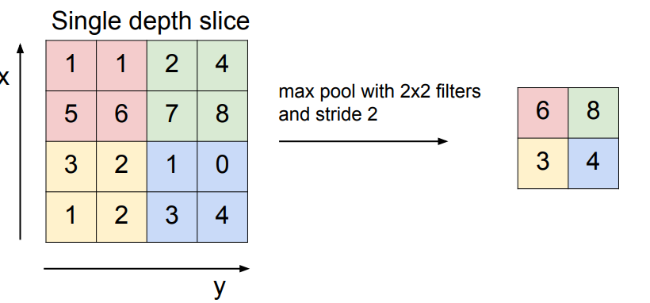
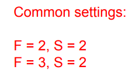
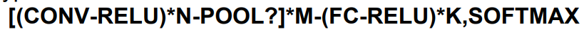

Lecture-5从神经网络的发展历史开始介绍，详细介绍了卷积层和全连接层；并且介绍了卷积操作中重要的padding和pooling(也可视为pool层，不过我倾向于将pooling与卷积联系更紧密)
<!--more-->

## History

从50年代Frank Rosenblatt开始研究感知机, 到86年第一次出现反向传播, 到在经历一段时间的沉寂之后的2000年代。神经网络不断发展, 知道2012年才第一次取得惊人的成果(AlexNet)。

如今convnet有着广泛的应用：
Classification, Retrieval, Detection, Segmentation, self-driving cars, face-recognition, pose recognition, game, interpretation and diagnosis of medical images, classification of galaxies, street sign recognition etc.

## Convolutional Neural Networks

### Convolution Layer
卷积层的特点是可以保持图片的结构(preserve spatial structure)

首先选取一个filter(卷积核)  

filter的深度和图片的深度相同

卷积操作 : 使用filter在图片上滑动，对每位元素进行点积运算

使用多个filter可以得到多个activation maps(激活映射)

在通常的情况下，使用filter可能不能和原始图像像素的数量整除开

所以需要padding操作

**padding的重要作用 : 保持输入和输出的尺寸相同**

常用的filter设置

filter也被称为receptive field(感受野) for each neuron

### Pooling layer

pooling 主要是个downsample(下采样)处理

**只在平面上做pooling 深度上不做**

max pooling

常用的pooling设置：

### Fully Connected Layer (FC layer)

### Typical architectures

[cifar10 demo](https://cs.stanford.edu/people/karpathy/convnetjs/demo/cifar10.html)

[slide](http://cs231n.stanford.edu/slides/2017/cs231n_2017_lecture5.pdf)