Lecture-6是介绍如何训练神经网络的第一部分，详细介绍了各种激活函数，并且介绍了神经网络领域中常用的数据预处理方法，以及一些在训练之前的权重初始化经验，超参数设置的经验和网络训练的流程。这节课还有个重要的知识点是Batch Normalization
<!--more-->

## Training Neural Networks Overview

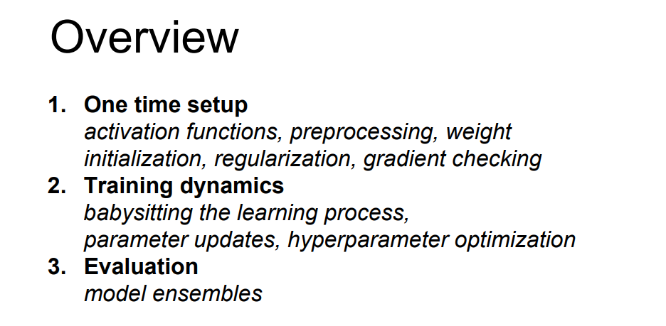

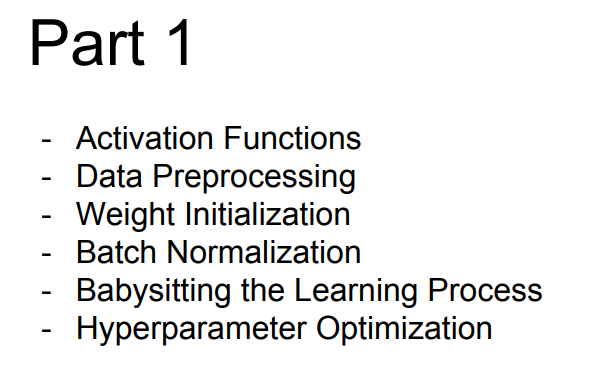

## Activation Functions(激活函数)

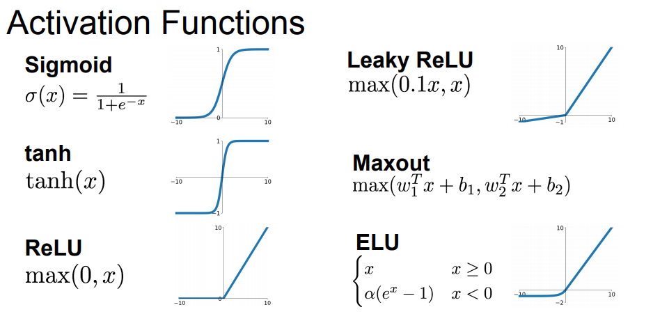

### Sigmoid

公式: 

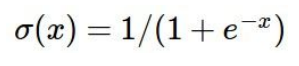

图像：

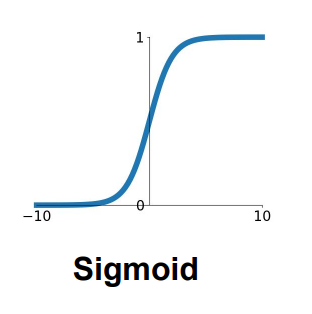

效果:

每个元素被压缩到[0,1]之间

问题:

**Sigmoid导致梯度消失**  

当输入数值很大的正值或者很大的负值的时候，会导致梯度成为0，从而无法得到梯度flow的反馈

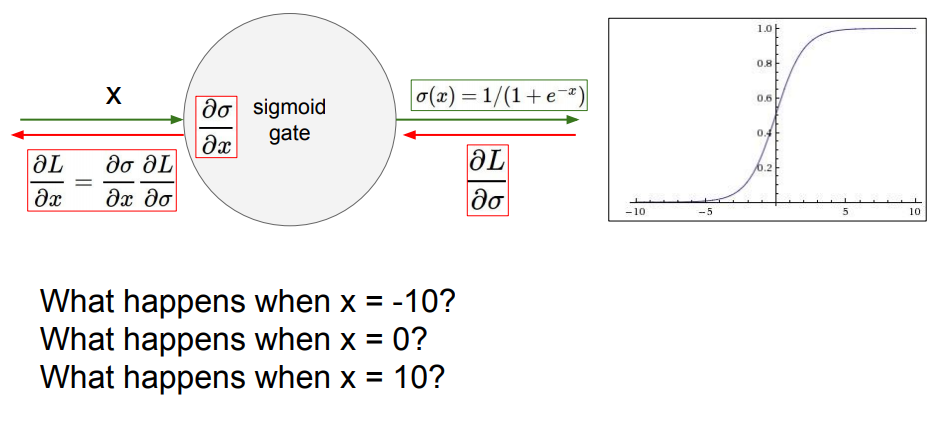

**sigmoid是非零中心函数**

如果输入数值全部大于零或全部小于零，会导致梯度下降的非常低效(下降方向被固定住了)

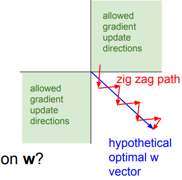

**存在exp()，计算成本高** (不是很重要的一点，因为卷积运算才是大头)

### tanh(x)

图像：

图像.png)

效果:

每个元素被压缩到[-1,1]之间

tanh(x)是zero-centered(零中心)函数

问题:

**导致梯度消失**  (与sigmoid类似，从图像可以看出)

### ReLU (Rectified Linear Unit)

公式: 

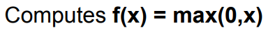

图像：

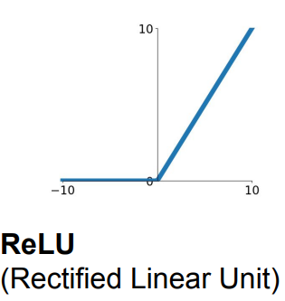

效果:

在正区域不会出现饱和的情况

计算高效(大概是sigmoid的6x)

与sigmoid相比更具有生物学上的合理性

问题:

**ReLU是非零中心函数**

**dead ReLU情况**
dead ReLU不会被激活和更新

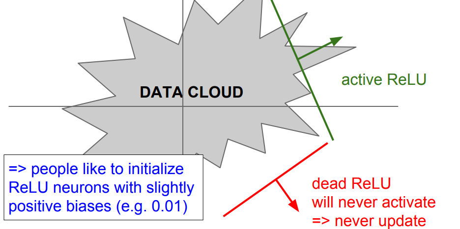

出现此情况的一些原因：
1. 初始化不好，权重设置的差
2. 学习率太大的时候

可以使用较小的正偏置来初始化ReLU，以增加其在初始化时被激活的可能性，并获得更新(但是是否有用存在争议，多数情况下还是设为0)

### Leaky ReLU

公式: 

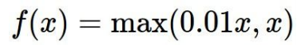

图像：

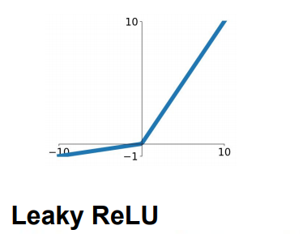

效果:

在正/负区域都不会出现饱和的情况

计算高效(大概是sigmoid的6x)

**没有dead ReLU情况**

### Parametric Rectifier (PReLU)

将alpha值当成一个学习参数而非设成固定值

公式: 

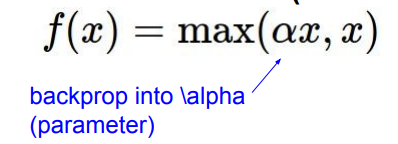

### Exponential Linear Units (ELU)

公式: 

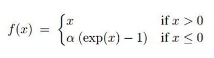

图像：

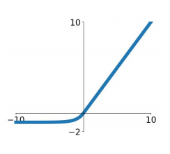

效果:

所有ReLU的有点ELU都有

实际上是介于ReLU和Leaky ReLU之间的

### Maxout

公式: 

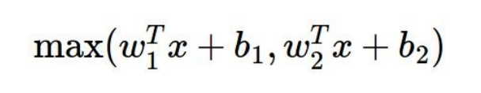

效果:

没有开始的点乘操作

是泛化的ReLU 和 Leaky ReLU 

线性机制的操作

不会饱和

没有’dead‘情况

问题:

参数数量会翻倍

### 激活函数的使用经验

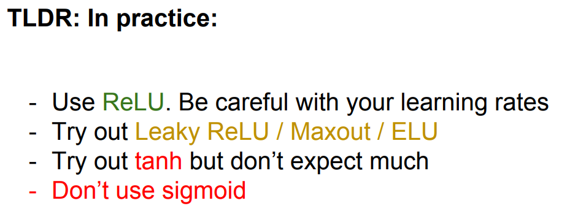

## Data Preprocessing(数据预处理)

### 常见的处理方法
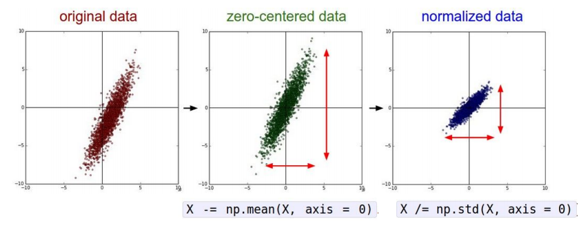

### DL中只使用zero-mean(零均值化)
在DL中，主要就使用 **zero-mean(零均值化)** 处理就好了

1. zero-mean data(零均值化)  
    
如果不将数据零中心处理，获得的梯度都将是次最优的优化
2. normalized(归一化) DL不常用  
    
通常归一化处理是在特征处于范围差别较大的情况下使用的，深度学习的特征一般都在一个小范围内，所以对归一化的使用不像一般的ML那么频繁

还有ML中常见的其他的更复杂的预处理方法，DL中一般都不会使用，因为对于图像信息来说，不希望将这些信息映射到更低维的空间中。通常DL算法希望直接使用卷积运算并且得到原图像的空间结构。

### 数据预处理的使用经验
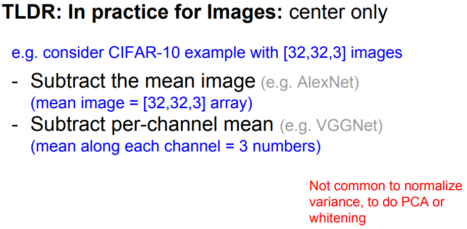

## Weight Initialization(初始化权重值)

### 当把所有权重值都初始化为0(不使用)
这样的话所有神经元都会做同样的事情，会有相同的梯度，都将会以相同的方式更新，这会导致所有神经元都是些相同的(而我们需要神经元学习到不同的东西)

所以不要用相同的权重值来初始化，这会导致无法打破参数对称问题

### 所有权重都是小的随机数(不使用)

假如用0.01乘标准高斯分布

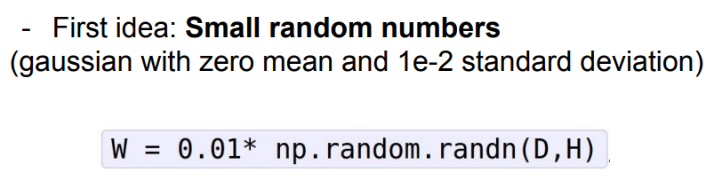

这种做法在浅层网络有效，但是在深层网络效果不好  

在深层网络中会导致无法持续激活

而且从反向传播来看，由于权值接近于零，会导致每层的梯度非常下，所以会导致基本上没什么更新

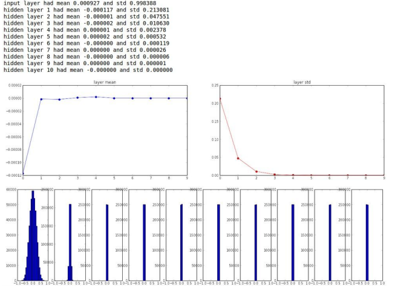

### 所有权重都是大的随机数(不使用)

假如用1乘标准高斯分布

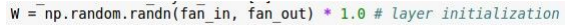

由于所有权值都很大，这会导致每层都处于饱和状态

而且所有梯队都会成为0，也会导致权值不会被更新

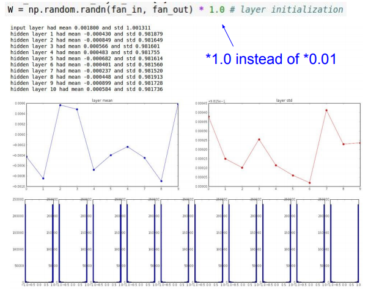

### Xavier initialization(推荐)

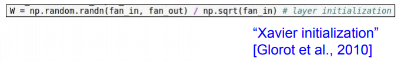

这种初始化方法效果不错：

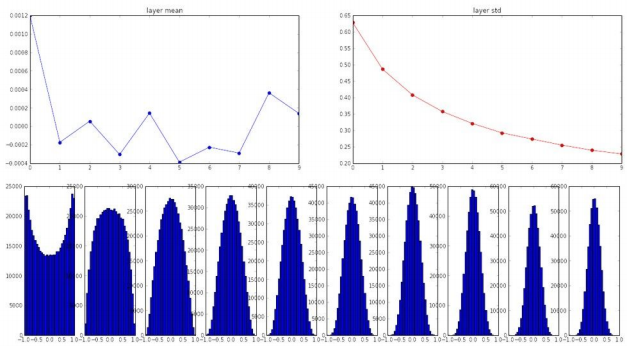

存在的问题是，当使用ReLU作为激活函数时，会有问题

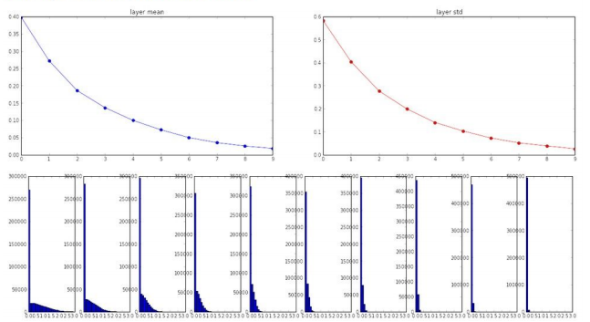

### Xavier initialization fix ReLU problem(推荐)

这好像是何凯明大大的论文！

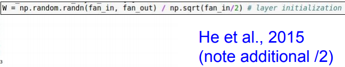

效果不错：

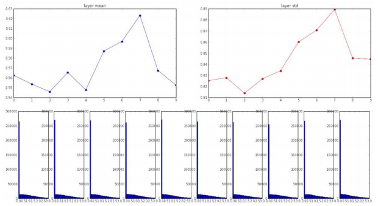

## Batch Normalization

在每一层batch(批量)激活，取目前batch处理的mean(均值)和方差来进行normalize(归一化)

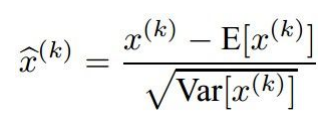

在训练开始时设置这个值而不是权值初始化的时候，以便可以在每一层都获得较好的高斯分布，并在训练时可以一直保持。

假设我们在当前的batch中，有N个样本，维度是D:

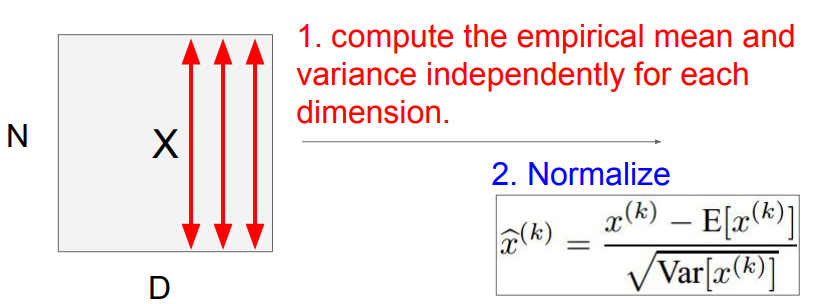

对每个维度都独立计算mean(均值)和variance(方差)

然后对其进行normalize(归一化)

Batch Normalization通常是在FC层或者Conv layer后，并且是在nonlinearity(非线性)处理之前插入的

在进行Batch Normalization之后，需要进行一次额外的缩放操作来恢复恒等函数。

整体的Batch Normalization过程:

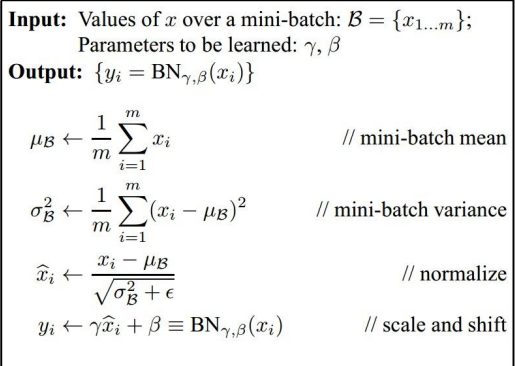

批量归一化的好处:
1. 改进了网络整体的梯度流
2. 提升了robust(鲁棒性)
3. 可以再更广范围的学习率和不同的初始值下工作
4. 可以作为一种正则化方法

## Babysitting the Learning Process

Step 1: Preprocess the data
Step 2: Choose the architecture

接下来的部分，老师介绍了一个网络训练的流程
一些要点：
1. disable regularizationr然后查看losss会否合理
2. crank up regularizationr然后查看loss是否如预期有所提升
3. Make sure that you can overfit very small portion of the training dataz在数据量较小的情况下，loss是否是0，换句话说accuracy能不能为1，就是看在小数据量的情况下，模型应该完美的拟合
4. loss not going down/Loss barely changing如果loss变化很小的话，可能是学习率设置的太小了
5. loss exploding的话，可能是学习率设置太大了
6. 通常设置的学习率在[1e-3 … 1e-5]之间 learning rate we should be cross-validating is somewhere [1e-3 … 1e-5]

## Hyperparameter Optimization

通常使用交叉验证来设置超参数或者学习率

### Cross-validation strategy

在训练集上面使用超参数，然后在验证集上观察这些超参数的实验效果

可以使用Random Search,在循环训练中，可以先初步的观察参数导致的交叉验证度，首先粗选一下，再进行细选。除了这种筛选方法之外还可以使用Grid Search

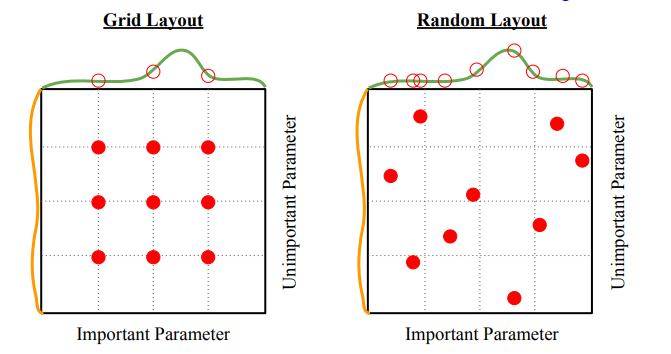

### 学习率

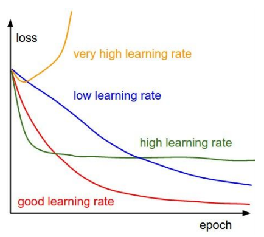

### 准确率

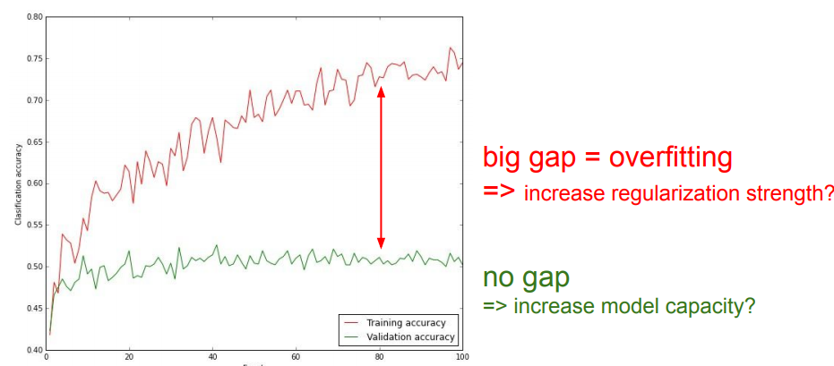

## TLDRs

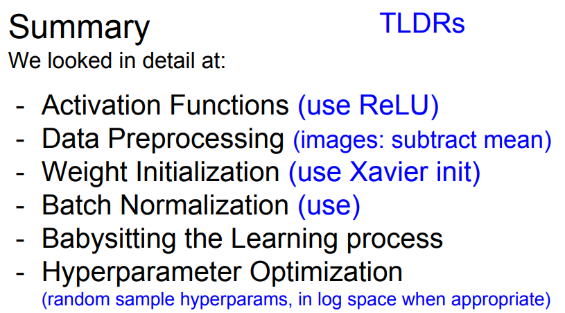

[slides](http://cs231n.stanford.edu/slides/2017/cs231n_2017_lecture6.pdf)