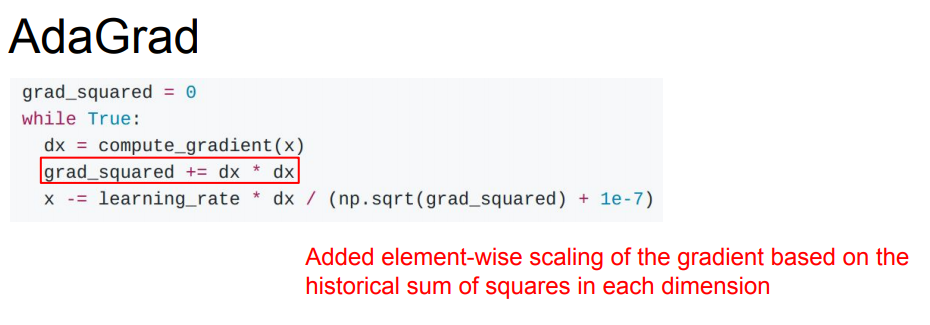
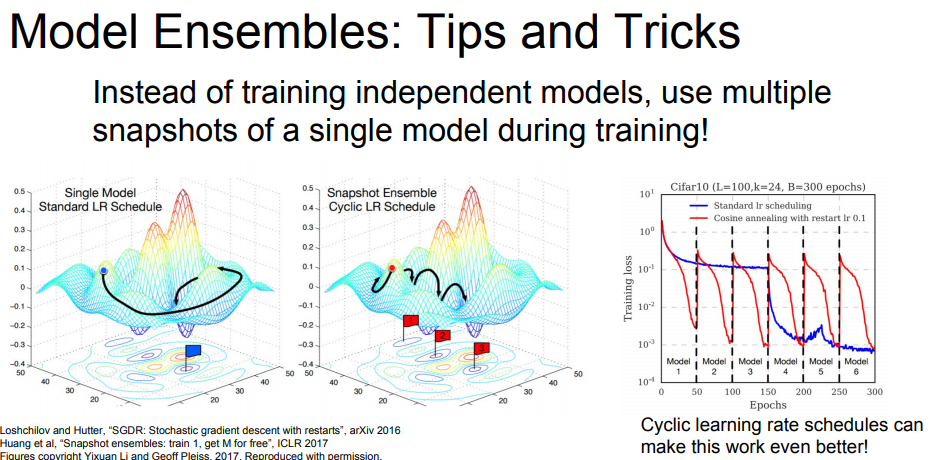

Lecture-7，介绍了进一步做优化的方法，比如给SGD加上动量以使其越过非极值点，还有最常应用的Adam算法；由对学习率的设置问题引出业界比较新颖的二阶优化的方法；而且，神经网络重点在于测试集上的效果，所以介绍了一些避免模型过拟合的正则化方法，如最常用的dropout；最后进一步介绍了迁移学习，可以将训练好的模型拿来针对自己的数据做一些调整使用
<!--more-->

## 回顾 

首先，课程回顾了一下之前所讲授的内容:

#### Activation Functions
关于激活函数，ReLU是常用的选择，不像sigmoid和tanH或有梯度弥散的问题

#### Weight Initialization
权值的初始化呢，不能过大(梯度会成为0，不会学习)或者过小(激活值会变成0，梯度也会变成0)

使用正确的初始化方法，如Xavier initialization 或者 MSRA initialization

权值的初始化选取随着网络层级越来越深会变得愈发重要

#### Data Preprocessing
关于数据的预处理，在深度学历领域，中心化和归一化是常用的

#### Batch Normalization
在传统网络中多加一层，以使得中间的激活值均值为0，方差为1

在正向传播的时候，使用小batch的均值和标准差，使用这个估值对整个数据进行归一化

这里2017年的slide写错了，我使用的2018年的slide

#### Babysitting Learning
观察损失函数曲线，查看损失函数变化情况

#### Hyperparameter Search
超参数搜索的方法，随即搜索比网格搜索具有优势

## Optimization

训练神经网络的核心，是优化问题

定义神经网络中的每个权值，使用损失函数界定这些权值是否恰当

### Problems with SGD

1. 当改变权值之一，损失值不敏感。当改变另外权值的时候，损失值却变得很敏感
这种问题在高纬度的情况下更加容易出现

1. SGD的另外一个问题是当遭遇local minima(局部最小值)/saddle points(鞍点，非极大或极小值点)的时候，会卡住

在一维问题中，局部最小值会是大问题。  
但是在高维情况下，鞍点的问题会发生的极其频繁

1. SGD还有个问题是是stochastic(随机)，由于通过一个小batch来计算权值，会引入噪音，而SGD在噪音附近的计算可能会浪费大量资源

### SGD + Momentum(动量项)，解决以上问题

老师的解释非常有创意，使用物理的惯性规则讲解这个问题。

### Nesterov Momentum

优化一下Nesterov

### AdaGrad

### RMSProp
可以理解为给梯度的平方加动量，

可以看到相比于普通的SGD加动量，RMS可以一直调整

### Adam
为了逐步理解，首先介绍了一下，与Adam非常接近的算法

但是这样计算的话，在最初的第一步时，第二动量会一直非常小，会得到非常大的步长

加上了Bias correction(偏置校正项)，避免过大的步长

**Adam在各种情况下表现都非常好**

### Learning rate

如何设置Learning rate？

有个小技巧是，使学习率随着时间衰减

从图示可以看出，在遇到平台期的时候，对学习率的衰减可以进一步降低损失

需要注意的是，在SGD+动量的时候，经常使用对学习率的衰减；而在Adam的时候很少用

还有，对学习率的衰减通常来说是个二阶超参是，不应该一开始就使用

先尝试不衰减，看看会发生什么，观察损失函数

### First-Order Optimization & Second-Order Optimization

我们之前了解的优化算法都是First-Order Optimization(一阶优化算法)

一阶优化算法我们使用一阶梯度信息计算目标函数的线性逼近(这里面涉及到了一阶偏导)

二阶逼近，同时考虑一阶梯度和二阶梯度信息，对函数做一个二阶泰勒逼近，实际上是使用二阶函数在局部逼近我们的目标函数

二阶优化让人惊讶之处在于: 没有超参数和学习率

从公式课件，二阶逼近需要求出Hessian(海森矩阵)的逆，因为Hessian是N×N的，N代表的是网络中的参数数量，这个N非常大，而转置这个Hessian将会更加巨大，所有这个理论的二阶逼近需要进一步提升

1. Quasi-Newton methods (BGFS most popular) 拟牛顿法
逼近Hessian的逆而非求出它

2. L-BFGS (Limited memory BFGS)
不将Hessian的逆全部存储

### 总结

## Beyond Training Error

我们更在意的是，在没见过的数据上，模型的表现

如何减少训练误差和测试误差才是我们需要的

### Model Ensembles(模型集成)

可以固定的，提升几个百分点

一些模型集成的Tricks：
1. 保存单个模型训练中的快照

2. Polyak averaging

## Regularization(正则化)

提升单一模型性能的办法——Regularization(正则化)

在模型中加入一些成分，防止模型在训练集上的过拟合

### Dropout
除了前面课程介绍的L2正则化之外，Dropout也是一种在DL领域经常使用的正则化方法

在每次前向传播的过程中，在每层随机的将一部分神经元置零，然后在网络中继续前进

解释dropout有效的原因:
1. Prevents co-adaptation of features(避免了特征间的相互适应)
2. 可以把dropout看成是一种共享参数的网络做集成学习
由于每次dropout产生的子网络都不想同，但是共享的参数是相同的，所以可以做如上理解

举例单个神经元，来说明在测试时的dropout产生的期望

对dropout做个总结:

关于 Inverted dropout

### 关于正则化的通用规则

在训练时，给网络增加一些随机性，在一定程度上扰乱它，防止过拟化
在测试时，要抵消掉所有随机性，提升泛化能力

### Data Augmentation(数据增强)

使用一些方法对自己的原始数据做处理:
1. Horizontal Flips(翻转)
2. Random crops and scales(随机抽取不同尺度的裁剪图像)
3. Color Jitter(色彩抖动)

数据增强这种思想可以被拓展与各个DL问题的领域，在遇到问题的时候可以想一下新奇的办法，拓充自己的数据

### 一些其他的正则化方法

1. DropConnect，不是每次将激活函数置零而是随机将权重矩阵的一些值置零

2. Fractional Max Pooling，部分做最大池化

3. Stochastic Depth，简单来说是丢掉一些层

## Transfer Learning(迁移学习)

使用正则化可以减小训练误差和测试误差之间的间隙

过拟合很多时候是由于数据不够，如果我们需要一个大的，泛化能力强的模型，在小数据集的时候很容易过拟合。

这时候我们可以使用正则化的方法，也可以选择迁移学习

首先获取到，训练好的CNNs模型

然后我们需要使用这个由大数据集训练出的特征模型用在我们的小数据集上面，我们通常重新初始化最后一层的特征到最后的分类输出之间的全连接层这部分的矩阵。重新随机初始化最后的矩阵，冻结前面层的权重，只需要训练一个线性分类器(最后这层)，让最后这层在我们自己的数据上做收敛

当我们拥有的数据量更大一些的时候，我们可以选择调整整个网络，更新整个网络的权值

一个通用的规则是，在更新网络的时候，将学习率调低(由于整个网络可能是只需要微调以适应我们自己的数据)

当使用迁移学习时，可能遇到的情况:

数据量小而且与模型图片相似时(如选择resnet模型，图片与IMAGENET相似)，只训练最后一层

数据量较大而且与模型图片相似时，精调模型

但是当自己的数据与模型的数据不太相同的时候(比如，选择使用IMAGENET训练的resnet模型，但是手中的数据是CT图片什么的)

数据量小的时候比较麻烦，可能需要做大的调整

数据量大的时候对模型进行更精细的调整

各个DL软件的模型库:

caffe: [caffe](https://github.com/BVLC/caffe/wiki/Model-Zoo)
tensorflow: [tensorflow](https://github.com/tensorflow/models)
pytorch: [pytorch](https://github.com/pytorch/vision)

## 总结

