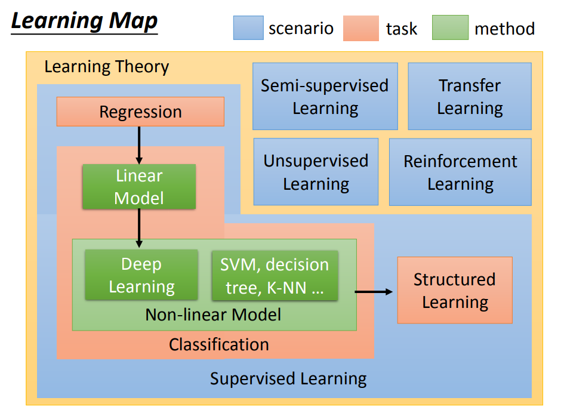

主要简介了ML领域面对的问题的一些分类情况

<!--more-->

## Learning Map

ML领域主要有：
Supervised Learning（监督学习）
Semi-supervised Learning（半监督学习）
Transfer Learning（迁移学习）
Unsupervised Learning（无监督学习）
Reinforcement Learning（强化学习）

这几个部分

### Supervised Learning
其中我们可以看到Map里面占有最大位置的是监督学习的部分

监督学习主要包括回归问题和分类问题，老师还提到了结构学习(Structuerd Learning)

而近些年大火的深度学习就在分类问题下的非线性模型中，所以说DL本质上就是分类问题，只不过它解决的问题往往是非常复杂的，非线性表示的

### Semi-supervised Learning
可以理解为部分数据是拥有标签的，但是还有部分数据是没有标签的

利用Unlabeled data优化function，也常用于数据不足时进行学习

### Transfer Learning
可以理解为使用已有的模型尝试解决未解决的问题，比如我们用个猫狗分类器尝试解决虎豹分类的问题，话说DL领域应该是经常使用这种方法

### Unsupervised Learning
重点在于data是Unlabeled

### Reinforcement Learning
强化学习主要通过结果的好坏自己去判断而进行学习，换句话说通过反馈来不断刺激自己的学习

[PDF](http://speech.ee.ntu.edu.tw/~tlkagk/courses/ML_2017_2/Lecture/introduction.pdf)