主要介绍了Regression
<!--more-->

### Output a scalar
### Step 1: Model

首先要寻求建立模型，由于是线性模型，所有参数有两w & b  
w : weight, b: bias  

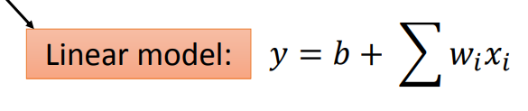

根据不同的w和b的组合，我们可以得到一批func，我们需要从中寻找出最佳的func作为我们的model

### Step 2: Goodness of Function
取得trainning data并且定义Loss function  
由loss func计算出我们的模型所生成的结果与data的拟合程度  
借此判断func的好坏
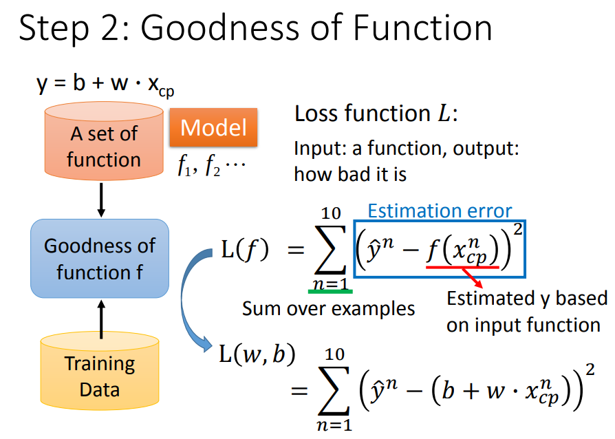

### Step 3: Best Function
要想取得最佳的func  
需要使用一些方法找到最佳的w和b

#### Step 3: Gradient Descent

这里主要介绍的是GD(Gradient Descent)
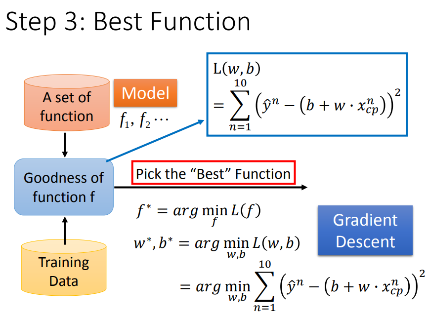

GD的公式是这样的：
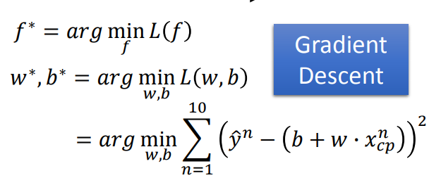

在梯度下降的开始，我们需要随机选取一个w并计算w的梯度
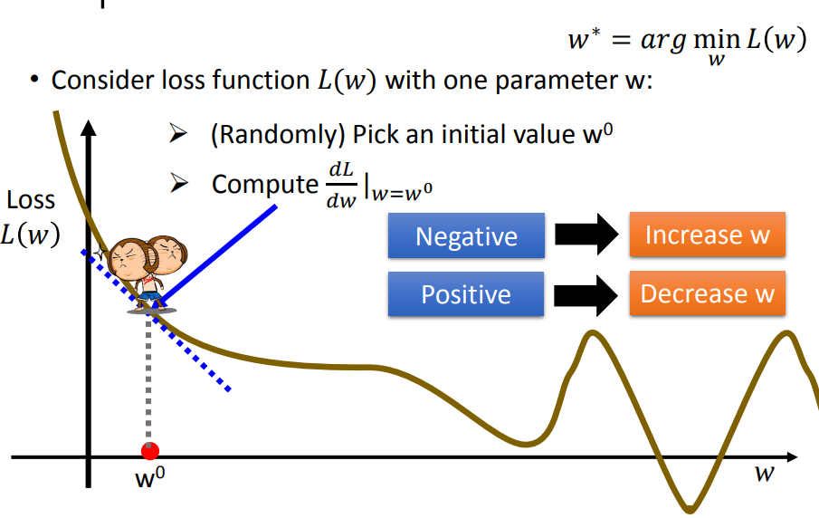

根据梯度的情况，增大或减小w(图像上看就是向左或向右移动)

在梯度下降的过程中，我们可以加入学习率控制步长
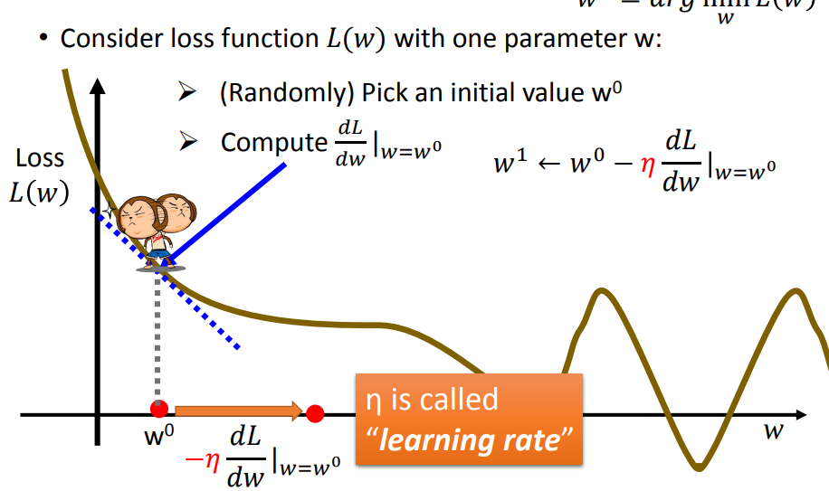

GD可能会在一些情况"stack"
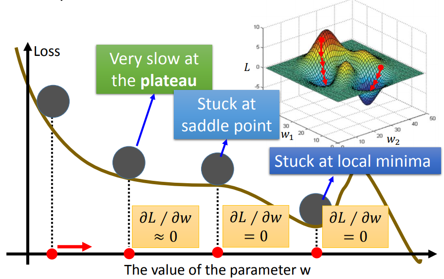

不过在Linear Regression中我们不用担心这点，因为线性回归的loss是凸函数("碗"状的)，肯定会落到最低(最佳)点

### How’s the results?

课程中使用的例子说明，在通过GD找到函数只有，误差依然较大
这时需要优化

把函数变复杂不失为一种可行的办法，因为更复杂的函数变大能力更强
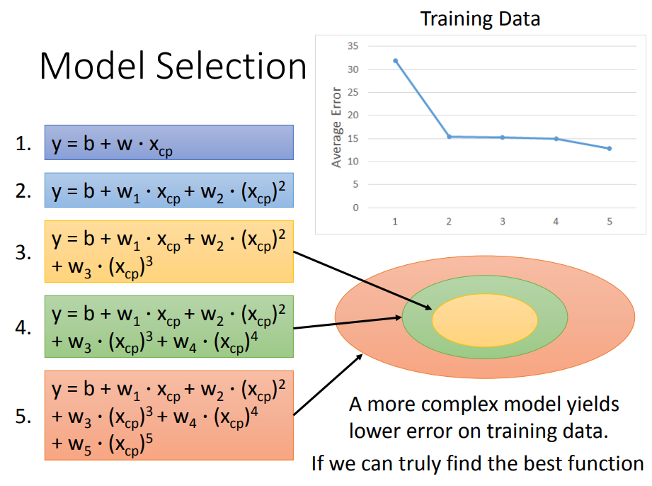

不过这带来的下面的问题
#### Overfitting
过拟合是常见的问题，主要就是函数太过于贴近训练数据了
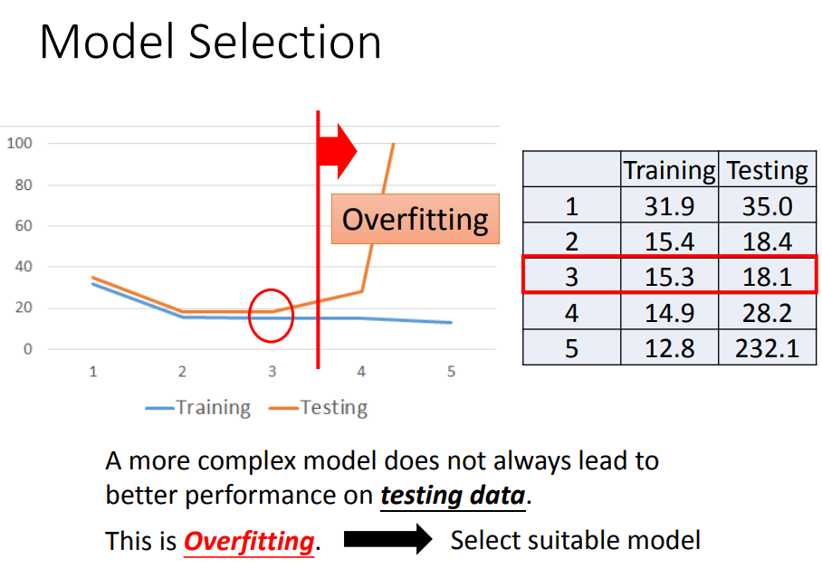

### Back to step 1: Redesign the Model
通过搜集更多数据的方法，可以一定程度上缓解过拟合的问题(因为可以找到更多影响结果的因素)

### Back to step 2: Regularization
正则化，是一个帮助我们找到"平滑"曲线(通常来说，"平滑"的func是我们需要的，因为"平滑"一定程度上表示"稳定")的好办法
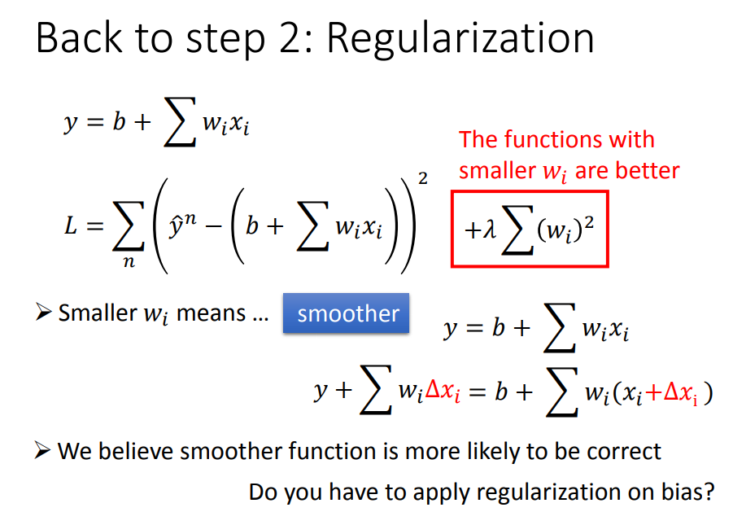

当然Regularization也不是越大越好
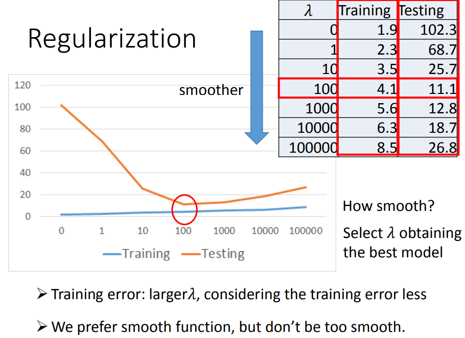

[PDF](http://speech.ee.ntu.edu.tw/~tlkagk/courses/ML_2017/Lecture/Regression.pdf)
