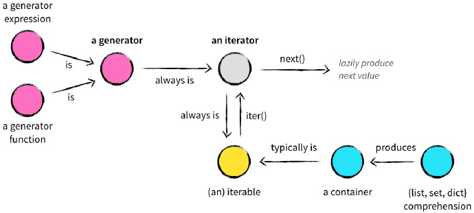

感觉在python中，"迭代"是个很重要的关键词，而且python3将所有内置函数的返回都改成了迭代器。所以python的可迭代对象，迭代器和生成器这些知识，是时候进行一番详细的梳理了
<!--more-->

## 关于"重复"的基本概念

一般程序语言中都有这样一些关于"重复"的概念，如loop、iterate、traversal 和 recursion，他们的通常的定义是:

- loop(循环): 在一定条件下，重复执行同一段代码，如python中的while;
- iterate(迭代): 按照某种顺序逐个访问容器中的每一项，如python中的for;
- traversal(递归): 不断调用自身，如斐波那契数列;
- recursion(遍历): 按照一定的规则访问结构中的每个节点，而且每个节点都只访问一次

通过这些定义，我们会发现python中的for语句并不能够像别的编程语言那样实现for循环，python的循环都是while来实现的；python的for用来实现迭代。

## 关于"迭代"的基本概念

那么在python中，关于"迭代"的概念，又有这些: iterable,iterator和generators

- iterable(可迭代对象): 定义了可以返回一个迭代器的\_\_iter\_\_方法，或者定义了可以支持下标索引的\_\_getitem\_\_方法
- iterator(迭代器): 定义了\_\_next\_\_方法
- generators(生成器): 含义yield的一种特殊的迭代器

## 可迭代对象与迭代器的关系

那么他们之间的关系是这样的:

**iter()这个函数，可以使可迭代对象转换为迭代器**



## 详解可迭代对象和迭代器

下面稍微详细介绍一下他们

#### 可迭代对象（Iterable）
具有\_\_iter\_\_ 方法，用于返回一个迭代器，或者定义了 \_\_getitem\_\_ 方法，可以按 index 索引的对象（并且能够在没有值时抛出一个 IndexError 异常）

可迭代对象可以通过for来迭代其中的每个元素；

可迭代对象可以通过index索引里面的每个元素(\_\_getitem\_\_)；

可迭代对象可以通过iter()返回迭代器(\_\_iter\_\_)；

可以通过isinstance(obj, collections.Iterable) 来判断对象是否为可迭代对象
```python
>>> import collections
>>> a = 'string is iterable'
>>> isinstance(a, collections.Iterable)
```

#### 迭代器（Iterator）
含有 next (Python 2) 或者 \_\_next\_\_ (Python 3) 方法

定义了\_\_next\_\_方法返回下一个值，在结尾处抛出StopIteration

可以通过 isinstance(obj, collections.Iterator) 来判断对象是否为迭代器
```python
>>> import collections
>>> a = 'string is iterable but not a iterator'
>>> isinstance(a, collections.Iterator)
False
>>> iter_a = iter(a)
>>> isinstance(iter_a, collections.Iterator)
True
```

#### for语句原理

for语句在python中适用于迭代的，而while才是真正的循环  

深究其差别在于，循环是可以增加跳过的条件的，但是迭代只能一个接着一个取值

在for语句的内部，是调用可迭代对象的iter()方法将可迭代对象转化为迭代器，然后在调用迭代器中的next()方法进行的迭代。for语句会自动捕获迭代器结束时的StopIteration异常并终止迭代。


## python的“迭代”
python尤其是python3之后，给人感觉尤其重视“迭代”。

我们可以看到有很多内置函数的返回都变成了迭代器，而且不止于此。

#### 文件迭代器

```python
f = open('test.txt', 'r')
# 返回第一行
f.readline()
# 返回第二行
f.readline()
...

```
由此可见，通过open打开的文件对象，通过readline读取的过程，就是一个迭代器不断调用\_\_next\_\_的过程。

#### os.popen和shelves对象也都是迭代器
不过这两个我目前不是很熟悉就先不写了

#### list和dict是可迭代对象不是迭代器
他们可以通过iter转换成迭代器
```python
>>> a = [1,2]
>>> a
[1, 2]
>>> iter(a) is a
False
>>> b = {'a':1, 'b':10}
>>> iter(b) is b
False

>>> b_ = iter(b)
>>> next(b_)
'a'
>>> next(b_)
'b'
>>> next(b_)
Traceback (most recent call last):
  File "<stdin>", line 1, in <module>
StopIteration
```

对于dict，转换成迭代器之后通过next调取到的是字典的key


### 关于dict.keys,dict.values和dict.items

首先，dict是可迭代对象非迭代器  

dict.keys,dict.values和dict.items都是可迭代对象非迭代器

```python
>>> d = dict(a=1, b=5)
>>> type(d)
<class 'dict'>
>>> next(d)
Traceback (most recent call last):
  File "<stdin>", line 1, in <module>
TypeError: 'dict' object is not an iterator

>>> keys_ = d.keys
>>> type(keys_)
<class 'builtin_function_or_method'>
>>> next(keys_)
Traceback (most recent call last):
  File "<stdin>", line 1, in <module>
TypeError: 'builtin_function_or_method' object is not an iterator

>>> values_  = d.values
>>> values_
<built-in method values of dict object at 0x7f6906370948>

>>> items_ = d.items
>>> items_
<built-in method items of dict object at 0x7f6906370948>
```

#### enumerate()返回的是迭代器

```python
>>> a = [1,2]
>>> type(enumerate(a))
<class 'enumerate'>
>>> n = enumerate(a)
>>> n
<enumerate object at 0x7f6906370708>
>>> next(n)
(0, 1)
```

#### map(),zip()和filter()返回的是迭代器

map
```python
>>> map(abs, [-1,-2,1])
<map object at 0x7f69063648d0>
>>> abs_ = map(abs, [-1,-2,1])
>>> next(abs_)
1
>>> next(abs_)
2
```

zip
```python
>>> zip([1,2,3], [7,8,9])
<zip object at 0x7f6906368208>
>>> zip_ = zip([1,2,3], [7,8,9])
>>> next(zip_)
(1, 7)
```

filter
```python
>>> filter(bool, [True, 1, 0, 's'])
<filter object at 0x7f6906364b00>
>>> filter_ = filter(bool, [True, 1, 0, 's'])
>>> next(filter_)
True
>>> next(filter_)
1
>>> next(filter_)
's'
```


## 详解生成器

#### 生成器(generator)
一个特殊的迭代器

任何包含 yield 语句的函数被称为生成器


#### 惰性计算
生成器表达式有一个特点，就是 **惰性计算**

这里有一段代码，对理解生成器的惰性计算非常重要
```python
def add(s, x):
    return s + x

def gen():
    for  i in range(4):
        yield i

base = gen()
for n in [1, 10]:
    base = (add(i, n) for i in base)

print(list(base))

### 代码返回的是
### [20, 21, 22, 23]
```

有个python代码执行的[可视化网站](http://pythontutor.com)可以帮助对这段代码进行理解