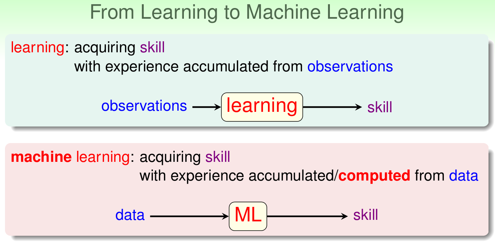
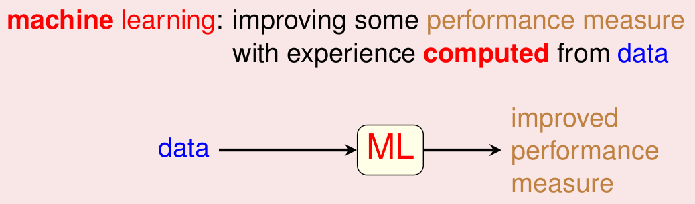
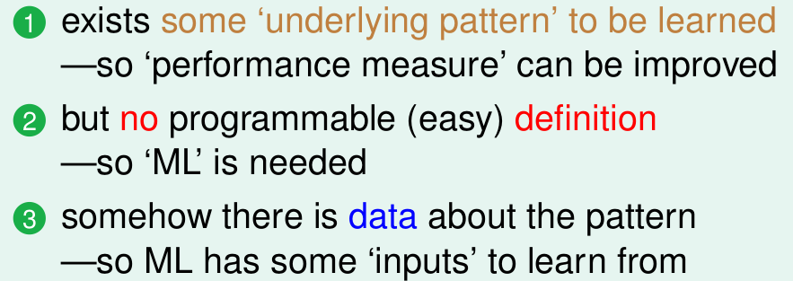
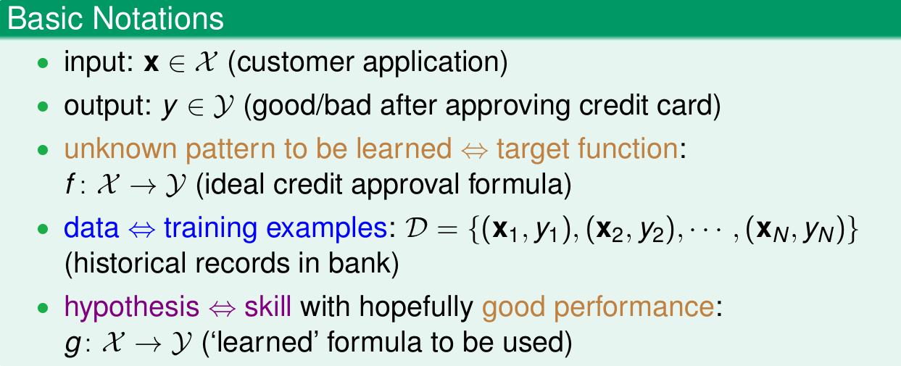
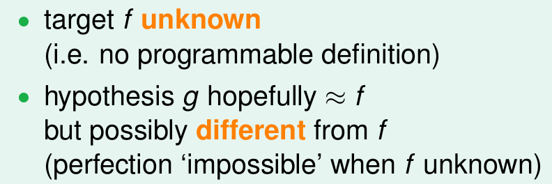
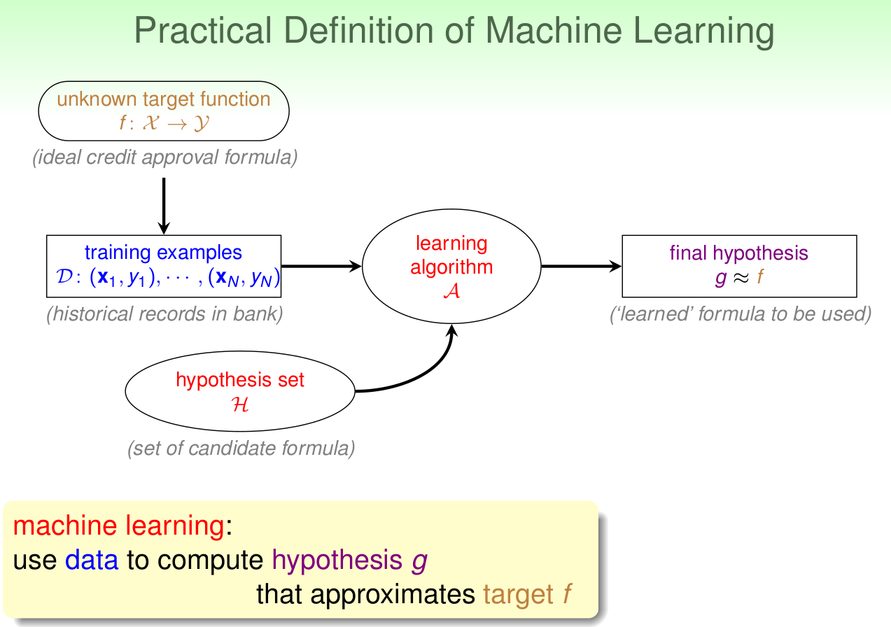
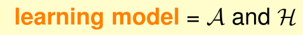

本科的时候看过NG的ML视频，在毕业设计的时候完成了一个简单的电影推荐系统。

毕业工作之后，虽然一直做着python数据方面的工作，但是还是对ML/DL念念不忘。

最近在看NTU林軒田的ML课程《机器学习基石》

打算在ML的理论知识上更进一步

留下一些简单的笔记以备后用，也希望可以帮助新入坑的同仁

FIGHT！

<!--more-->

## What is Machine Learning
正如每个ML课程开始都会讲到的一样，田老师也阐述了“学习”的概念，并以人类作对比，介绍了ML的基本概念

人类通过“观察”来进行学习，而机器则通过“数据”进行学习

Machine Learning被定义为：improving some performance measure with experience computed from data
(其实在业界ML是没有被准确定义的，每本经典教材都会有个自己的定义方式)

虽然ML应用广泛，但是还是要区分ML能否使用的场景：

简单来讲就是这三点：
1. 存在“潜在”规则
2. 不方便编程
3. 有数据

## Applications of Machine Learning

ML在众多领域有着出色的应用，田老师从“衣食住行”等方面进行了介绍

## Components of Machine Learning

这部分介绍了ML的基本结构和大概流程：

1. input
2. output
3. target function 就是我们想要找出的F
4. data
5. hypothesis 一些假设的集合

我们通过ML想要得到的目标就是

对于这个未知的F，我们需要求得一个最接近F的近似g

所有这里我们可以给出一个比较有应用价值的ML结构：

需要注意的：
1. learning algorithm A 是演算法
2. ypothesis set H 是假设的集合

## Machine Learning and Other Fields

这部分比较简单，主要介绍了ML和 Data Mining, Artificial Intelligence, Statistics等领域的关系和差别

最后 贴上[课程的主页](https://www.csie.ntu.edu.tw/~htlin/)

