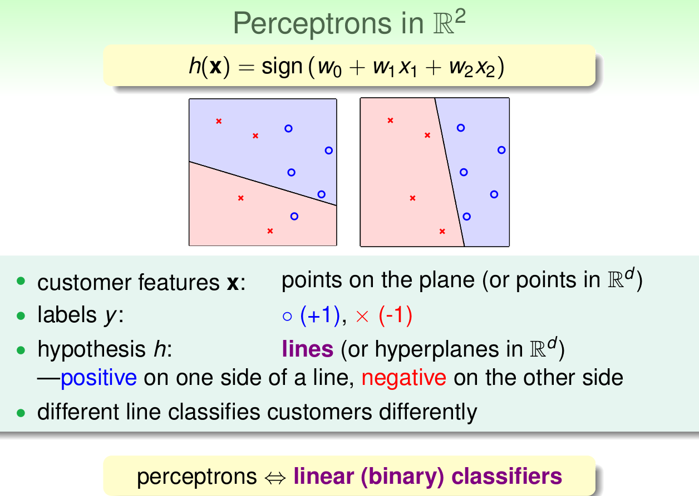

这节主要介绍了解决“是/否”问题(二分问题)的一种方法，PLA。

由上节课我们可以知道，在ML的整个流程中
主要是这样一些步骤：
1. 找到一批模型H
2. 使用演算法A，
3. 在训练样本D(data)上做训练
4. 得到最好的h
5. h所对应的g一般接近于目标函数f，这个g就是最后得到的机器学习的模型函数

那么第二节课，主要会介绍这样一些问题

<!--more-->

## Perceptron Hypothesis Set
这部分主要介绍感知机的模型集合，并由此逐步介绍到PLA算法。

首先假设一个“银行是否办理信用卡”的经典ML问题  
我们有“用户”的一些信息，这些信息对于“办理信用卡”这个问题的影响可能是正向也可能是反向的，在实际问题中，对于信息中的不同项，我们一般会赋予不同大小的权重值w，但是在此例中，我们将其简化为+1/-1

由此我们可以得到，在连加整个“权值x数据项”的结果后，在于一个“阈值”进行比较，最后得到“是/否”的结果，帮助我们进行判断

那么这样的一个Hypothesis Set，我们称其为Perceptron Hypothesis Set(感知机模型)

为了更好的展示Perceptron_H，我们将其转化为平面中，用“将数据分为两部分的线”来理解Perceptron

由此我们可以知道，“感知机问题”就是线性可分问题

## Perceptron Learning Algorithm (PLA)

那么如何在H中找到最符合PLA结果的ｇ呢？

需要我们不断的通过数据来“纠正”

这个问题PLA的过程可以简单理解为：

1. 首先选择一条随机直线将区域划分为两部分
2. 找到一个分类错误的点，用这个点帮助修正
3. 如果这个点本应是正，被误分为负，即w_t ^ x_n(t) < 0即表示w和x夹角大于90度，其中w是随机直线的法向量，说明x被误分在直线的下侧(法向量方向视为正)
4. 修正：使w和x的夹角小于90度
5. 同理，如果是误分为正类的点，即w_t ^ x_n(t) > 0那表示w和x夹角小于90度修正的方法就是使w和x夹角大于90度

使用这个办法，逐步循环下去，就可以将(线性可分)问题解决

可见此例：

最后，我们还要思考：
1. PLA一定会停止么，如果线性不可分应该怎么办？
2. 如果停下了，能否保证g与f尽可能的接近？
如果没停下来，是否能找到与f尽可能相似的g？

## Guarantee of PLA
PLA什么时候会停下来？

正如上面所讲的PLA算法的过程，在找到一条直线可以将界限内所有的点恰好分为两部分的时候，即面对的问题是linear separable(线性可分)的时候
PLA会停下来

如果可以找到直线将区域内所有点都区分开，即

那么我们所找到的w_t必然是与w_f越来越相近的，即

可以看出相比于w(t),w(t+1)与w(f)的內积更大

当然这并不能完全说明w(t+1)与w(f)的接近程度  
那么我们再计算一下w(t+1)与w(f)向量长度的关系，即

由此可见，w(t)的增长是被限制的，所以w(t+1)与w(f)向量长度不会相差太大

最后我们可以总结出：

## Non-Separable Data
很多时候，我们面对的问题是现行不可分的

当问题是现行不可分的时候，PLA就无法顺利停止，因为不存在那么一条可将区域分开的线

所以，面对这种情况

我们可以当做在数据中混入了“噪音”

而把PLA的条件放松

进而，我们得到了PLA算法的改进版本：Pocket Algorithm

Pocket_Algorithm算法与PLA算法大体相同，不过多了一些记录“noise”个数的步骤，这样在经过N此迭代以后，我们选取“noise”个数最小的那条直线即可以作为与w(f)最相似的g
