这节课的主题很单一并明确：从各个角度阐述机器学习的各种分类

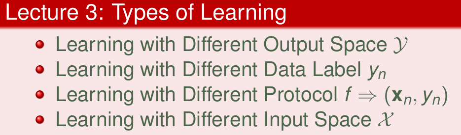

<!--more-->

## Learning with Different Output Space Y

在上节课讨论的PLA，主要aim的是线性二分类问题  

二元分类是机器学习领域非常核心和基本的问题

而二元问题并非只有线性的：

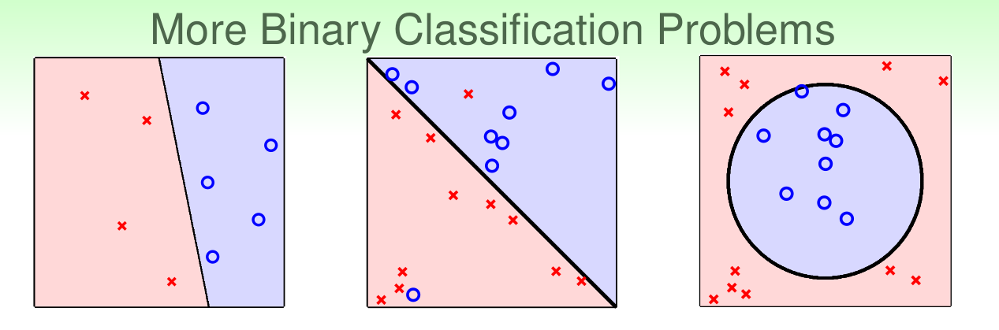

非线性问题需要寻找不同的模型解决

多分类问题，正如其名，多元分类的输出大于两个，y={1, 2, … , K}, K>2  

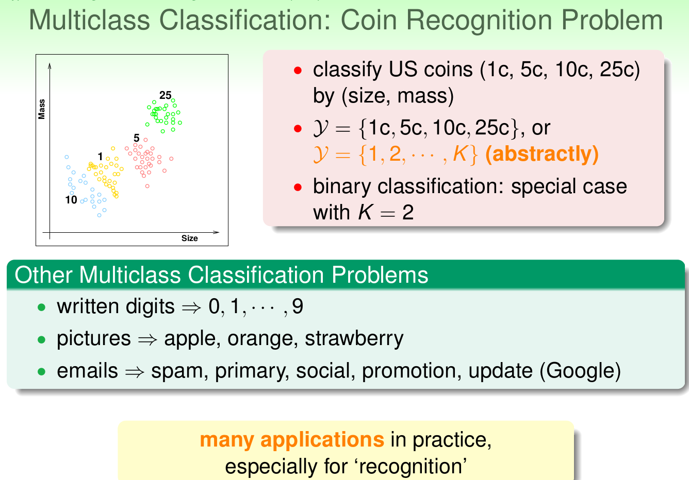

不论二元问题还是多分类问题，输出的结果都是离散值，而机器学习还有另外一种类比：回归问题

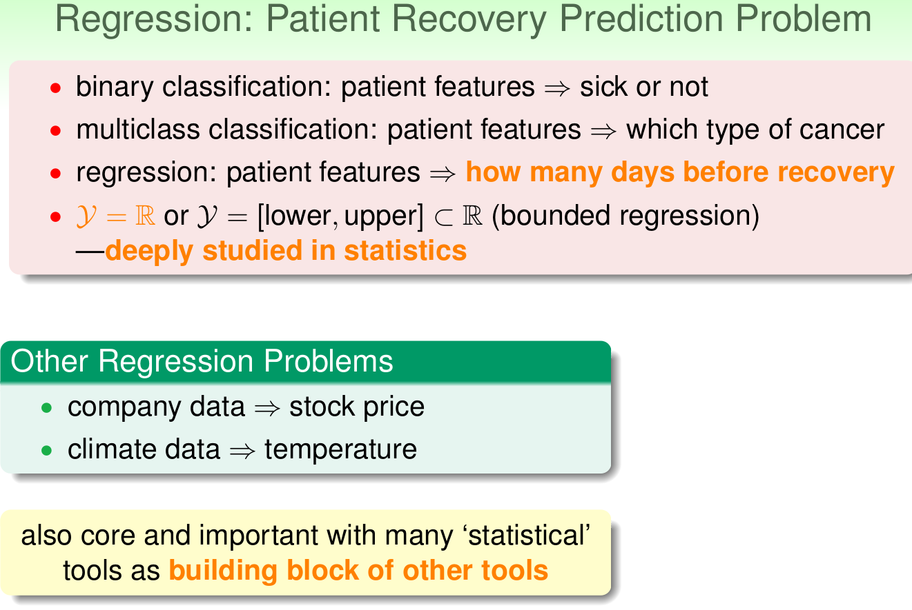

除了分类和回归问题之外，还有一种经典的ML的算法：Structured Learning

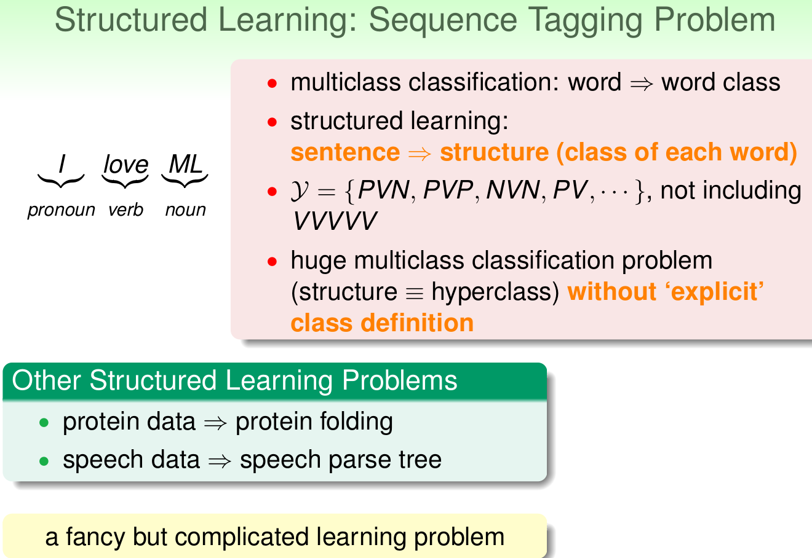

#### Mini Summary

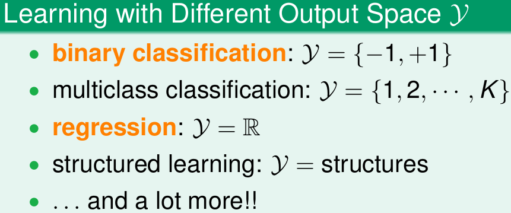

## Learning with Different Data Label y_n

从训练数据是否有标签的角度看，ML又可以有别的分类方法

如果训练数据都是有标签的话，这个ML问题是：Supervised Learning

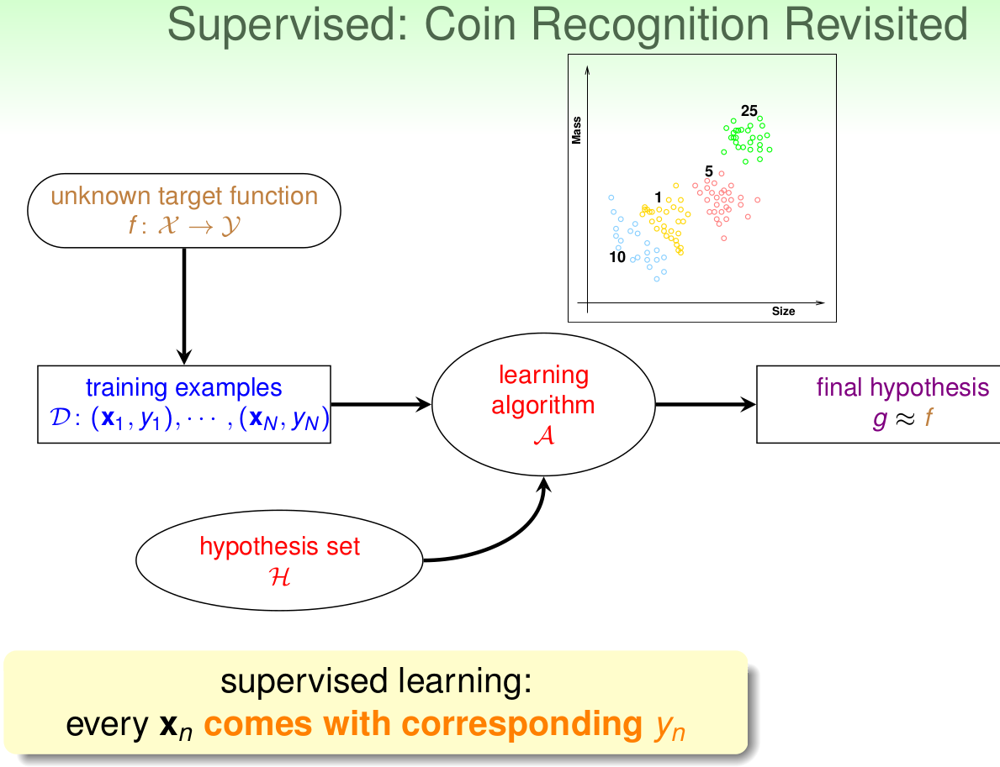

如果训练数据都是没有标签的话，这个ML问题是：Unsupervised Learning

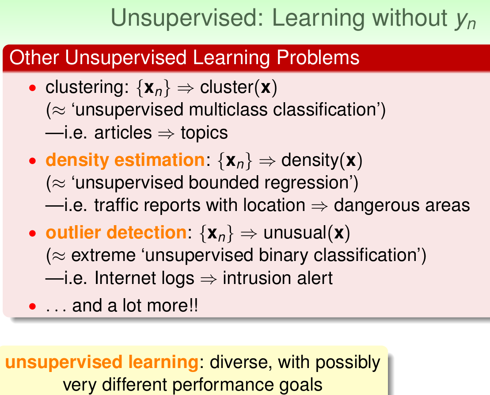

#### Supervised_Learning VS Unsupervised_Learning:

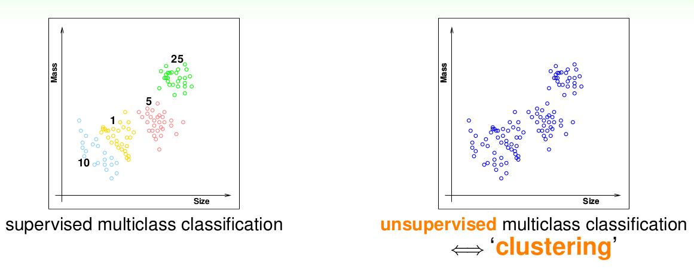

通常情况下，非监督式学习更复杂一些，多数的非监督的问题都可以使用监督学习的一些算法思想实现

监督学习和无监督学习是ML领域最广为人知的两种方法，那么有没有一种折中的办法呢？

当手中的有标签数据有限时，就需要这种办法了

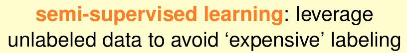

#### Supervised_Learning VS Unsupervised_Learning VS Semi_supervised_Learning:

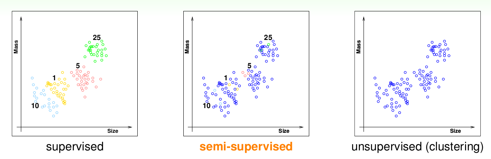

除了以上三种之外，还有一种非常重要的类型：Reinforcement Learning
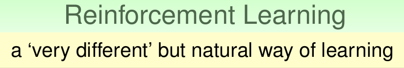

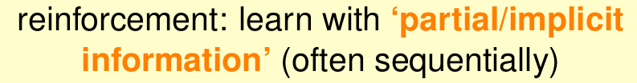

#### Mini Summary

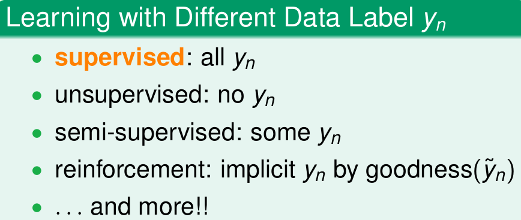

## Learning with Different Protocol f => (x_n,y_n)

按照不同的训练协议/方法，我们又可以将ML问题重新归类

通常情况下，我们使用的方法叫做：Batch Learning

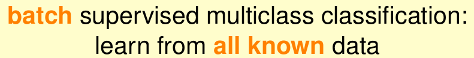

batch方法，通常可以得到一个被训练好的模型拿来使用

而对于一下在线系统，需要不断地update以满足最新的要求

对于这种需求，就出现了：Online Learning

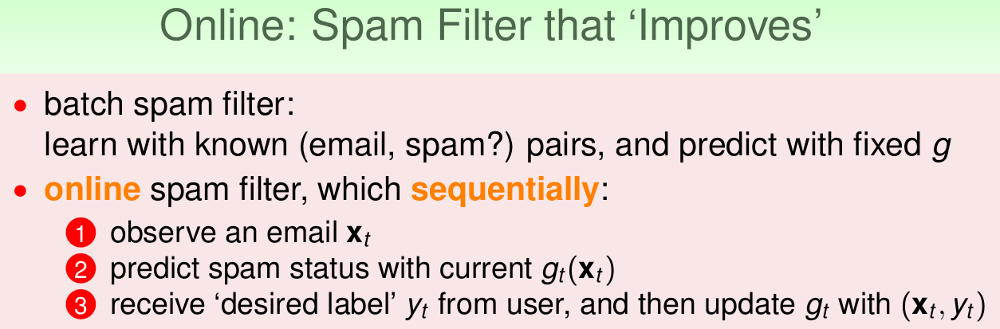

而近些年随着ML/DL领域的发展，现在还有了新方法：Active Learning

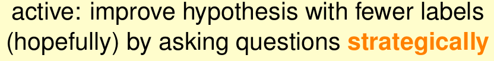

Active Learning优势之一是在获取样本label比较困难的时候，可以节约时间和成本，只对一些重要的label提出需求

林老师对这三种有一个很精彩的比喻：
对应于现实中老师的教学，一一对应为：填鸭式，教授式以及主动提问式

#### Mini Summary

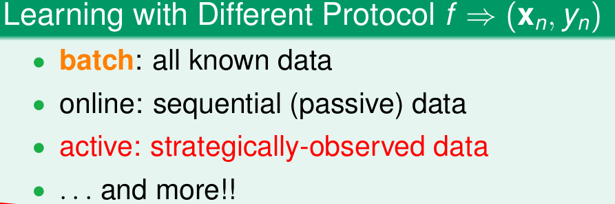

## Learning with Different Input Space X

这部分关注的是：输入

随着输入数据的抽象程度的提升，我们又可以从另一个角度看待ML问题

Concrete Features
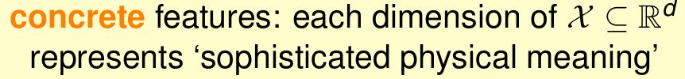

Raw Features
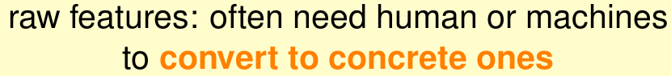

Abstract Features
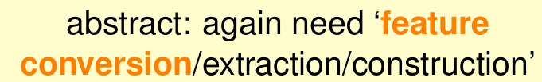

#### Mini Summary

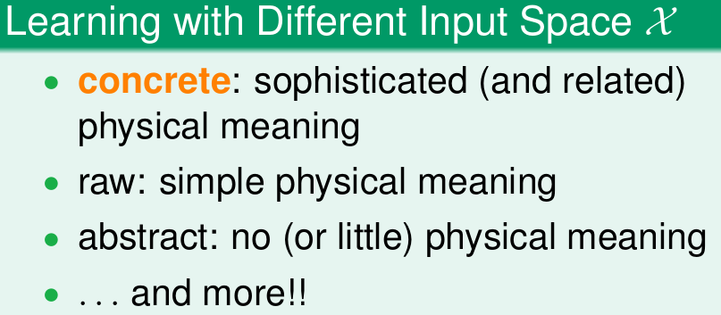