从这节开始，课程逐渐进入到ML的一些理论问题的讨论

这节课讨论的是：ML的可行性

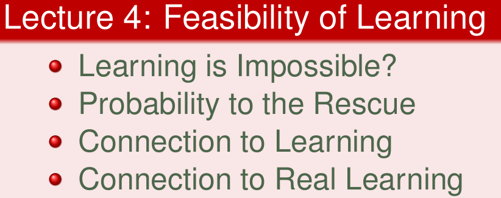

**Hoeffding's inequality是ML的理论基础，可以推导出机器学习在理论上的可行性**

<!--more-->

## Learning is Impossible?

这部分的引例主要是想介绍：免费午餐（No Free Lunch）定理

说明不存在一个ML算法可以解决任何领域的问题

实际上就是在说脱离实际问题讨论ML是没有意义的

这部分举了两个例子，第一个是“对九宫格图像分类”，还有个是“二进制表达数的分类”

对九宫格图像分类的例子说明，对一个问题使用不同的规则看待会有不同的结果
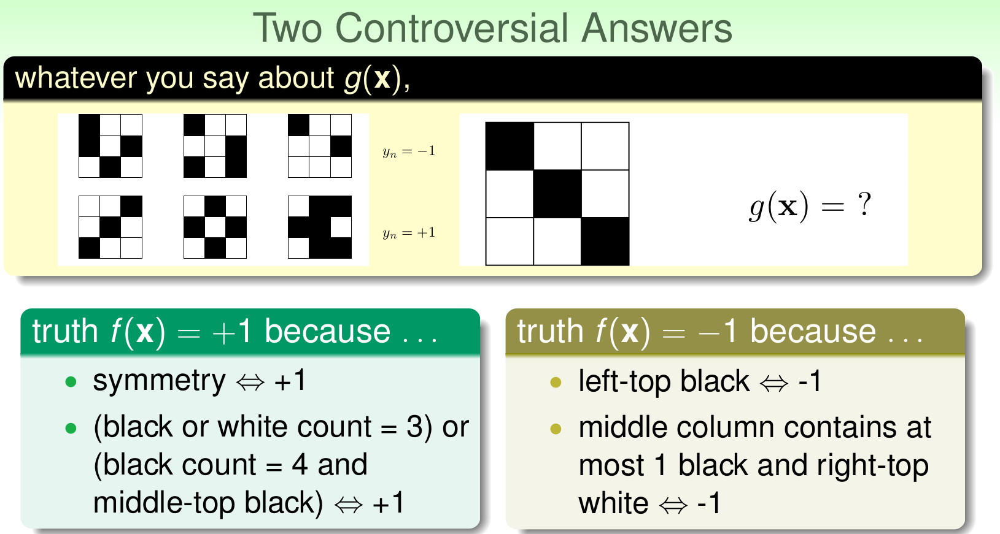

二进制分类的问题引入了免费午餐（No Free Lunch）定理
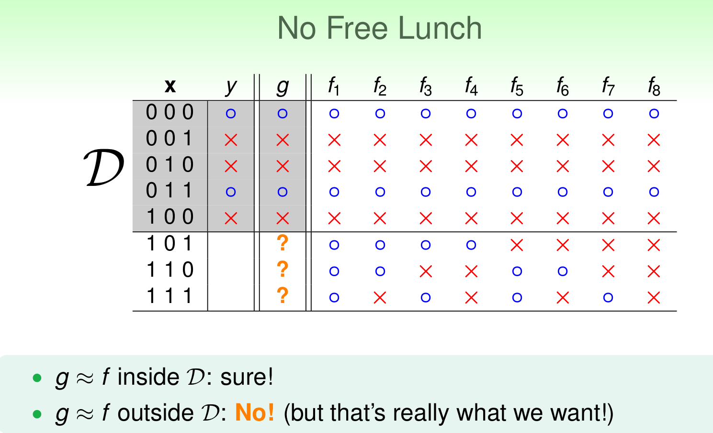

NFL说明，对于已知数据外的数据，无法确定通过现有数据计算的g是否有效
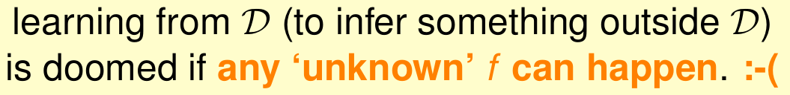

## Probability to the Rescue

如何使ML有效？

这部分主要通过统计学知识中采样估算的方法，引入了霍夫丁不等式（Hoeffding's inequality）

**Hoeffding's inequality是ML的理论基础，可以推导出机器学习在理论上的可行性**

举例是在如何估算罐头中两种颜色球的比例的问题

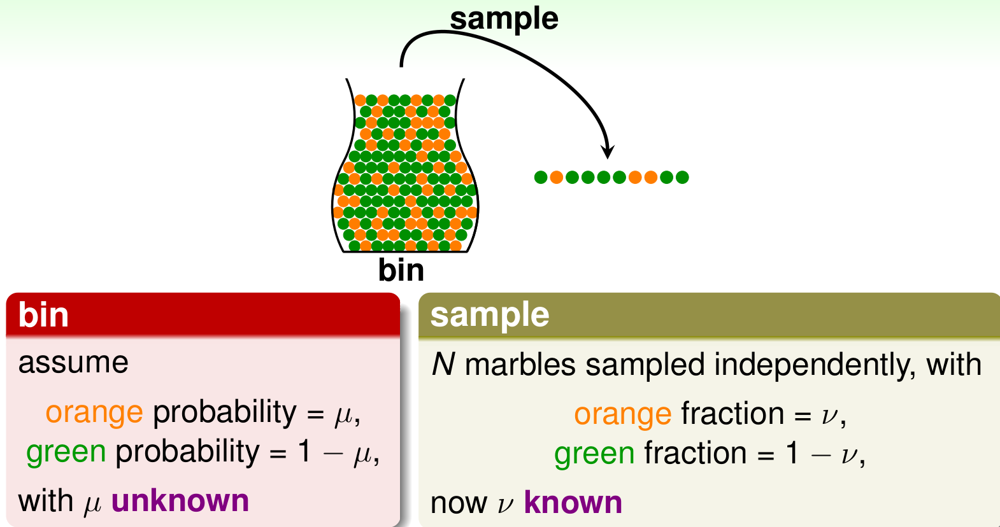

采样中橙色的概率能否估算出罐头中橙色的概率呢？

样本可以推至整体
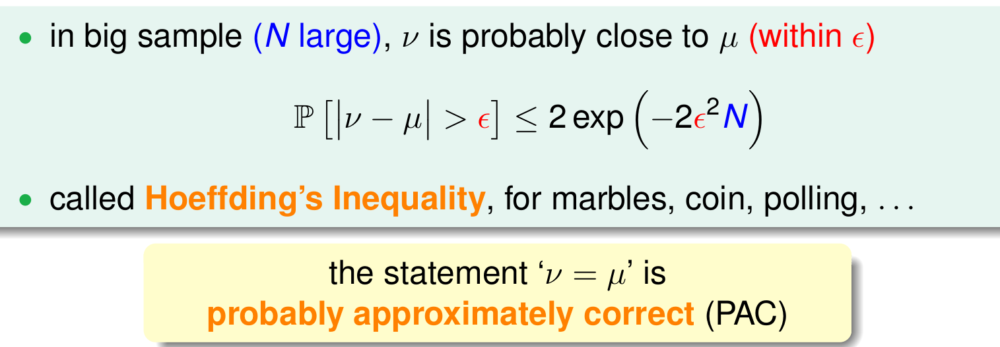

Hoeffding's inequality  
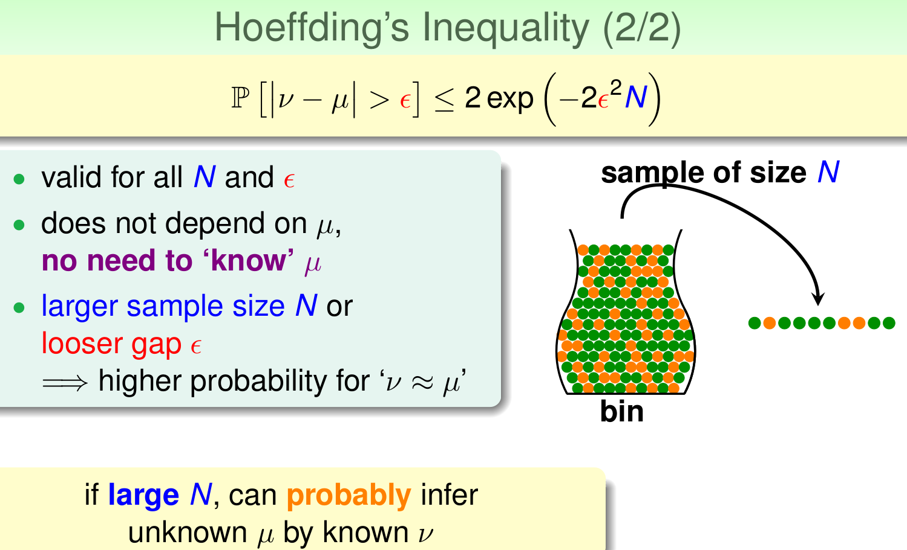

## Connection to Learning

将上例与ML联系起来

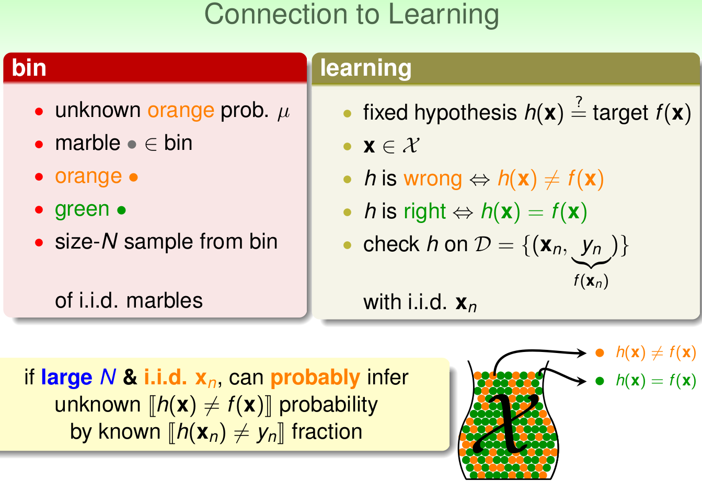

1. 罐子中橙色球的概率问题 ==》 ML的hypothesis是否与目标函数g相等的可能性
2. 罐子中所有球 ==》 ML的样本空间x
3. 橙色的弹珠类 ==》 h(x)与f不相等
4. 绿色的弹珠类 ==》 h(x)与f相等
5. 罐头中抽取的N个样本 ==》 ML中的train的样本D，并且这两种样本和总体是独立分布的

这么一对比，可以看出当N足够大且独立分布时，从样本中h_x != f_x的概率就能推导在抽样样本外的所有样本中h_x(n) != y(n)的概率是多少。

把样本中橙的概率理解为样本数据集D上h(x)错误的概率，以此推算出在所有数据上h(x)错误的概率

样本得到的结果和整体的结果是PAC的

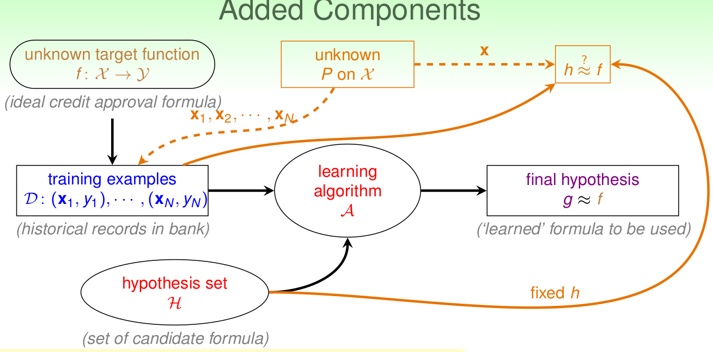

这里引入两个值：

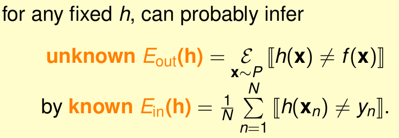

E_in 表示 抽样样本 中，h_x(n) != y(n)的概率

E_out 表示 全部样本 中，h_x != f_x的概率

E_in和E_out PAC
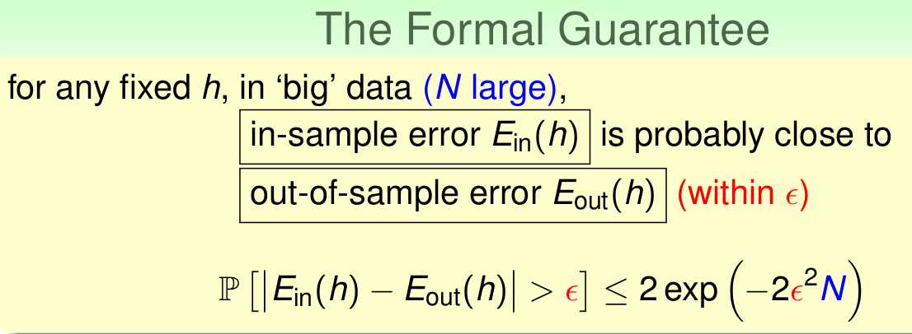

## Connection to Real Learning

在实际的ML中

数据D和hypothesis都有很多种

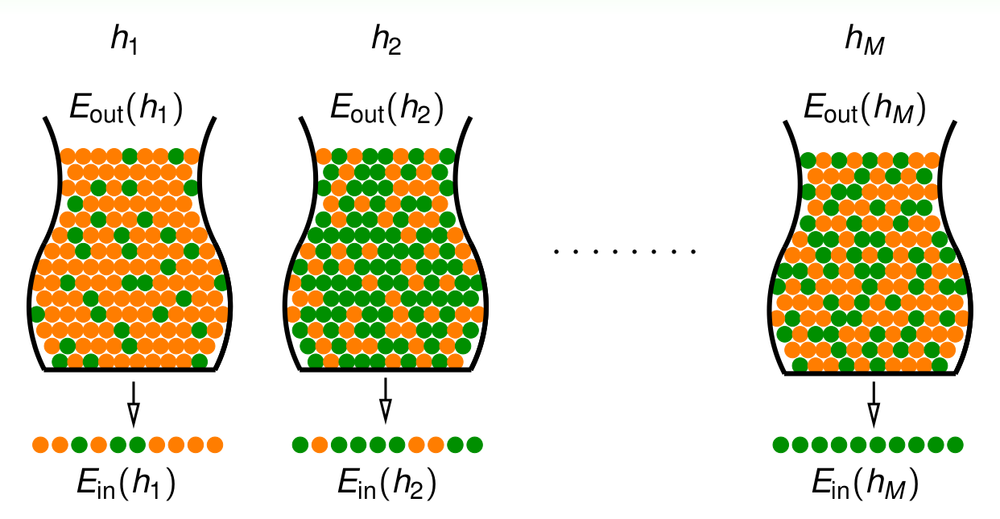

很多种情况Bad DATA会出现

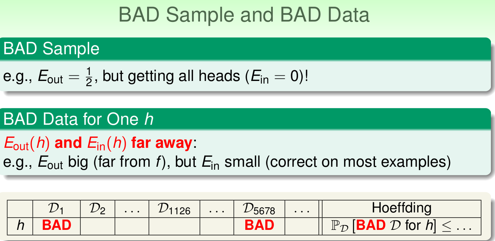

对应多种h都是bad data的条件

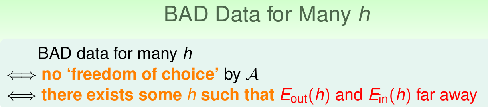

如何确定bad data的上界呢？

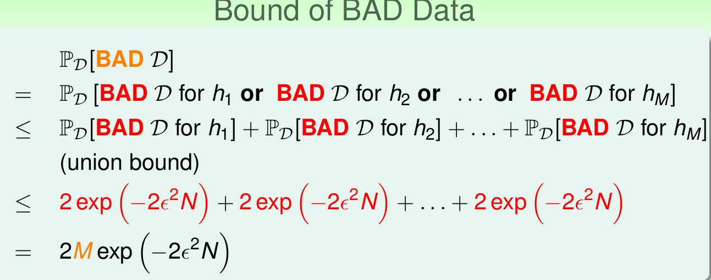

Bad Data的上界可以表示为连级（union bound）的形式

1. M是hypothesis的个数
2. N是样本D的数量
3. ϵ是参数

该union bound表明，当M有限，且N足够大的时候，  
Bad Data出现的概率就更低了，即能保证D对于所有的h都有E_in_and_E_out PAC

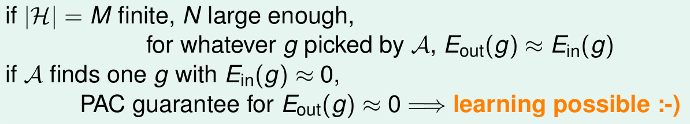

所以证明ML是可行的
