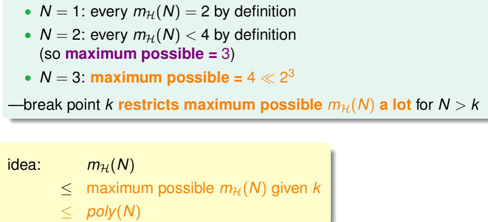
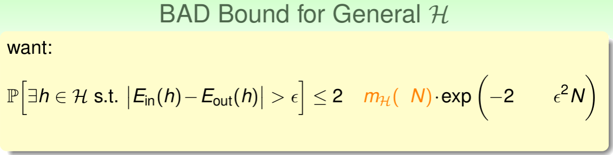

第五课提到，当N()无限大的时候，ML不可行

所以我们引入了growth function来替换N，验证ML是可行的

对此我们还介绍了break point的概念

在上节课的结尾，简述了break point与m_h(N)的关系

这节课会继续探索break point与m_h(N)的关系

<!--more-->

## Restriction of Break Point
回顾上节课的Growth_Function，也就是m_k(h)

m_k(h)是指样本中能产生的最多的dichotomy(二分)数

回看上节课的Growth_Function的总结

现在引入一个例子

如果说对于一个hypothesis set，它的break point是2，即k = 2

那么：

1. N = 1，m_k(1) = 2 可以满足完全二分的情况
2. N = 2，由于break point是2，所以m_k(2) < 2^2 = 4,所以最大就是3
3. N = 3时，对于三个数据点,   
hypothesis可以产生一个dichotomy(如ooo),  
hypothesis可以产生两个dichotomies(如ooo和oxo),  
hypothesis也可以产生三个dichotomies(比如ooo,oxo,xoo),  
hypothesis也可以四个dichotomies(ooo,oxo,xoo,oox),  
但是当hypothesis尝试从三个数据点产生五个dichotomies时的时候,无论怎样都会有两个点被shattered  

所以，break point k 对于限制m_k(h)作用很大

或许，通过给定的**N和k**，我们可以通过上节课的Hoeffding's inequality证明替代N的m_k(h)是多项式的

继而证明ML的可行性

## Bounding Function: Basic Cases

#### Bounding_Function

我们的目标是要证明：B(N,k)是poly的

目前我们可以得到这样的一些结论：

1. k=1时，B(N,k)=1
2. B(2, 2) = 3， B(3, 2) = 4
3. B(N, k) = 2^N for N < k
4. B(N, k) = 2^N − 1 for N = k

这样我们可以填入表格的一半了

接下来，让我们填写剩下的部分

## Bounding Function: Inductive Cases

这部分是一段很巧妙的证明

以B(4, 3)举例

我们获得所有的情况

将他们分为两类

1. orange: pair
2. purple: single

对于成双的，我们将其x4暂时去掉，并减半(减去重复部分)

得到：α + β ≤ B(3, 3)

得到：α ≤ B(3, 2)

进而我们获得这样的结论(将上面三个得到的公式连接)

可以暂时填写表格的"上界"

进而我们获得公式：

通过求得的公式可以得到break point

## A Pictorial Proof

如果能将m_H(N)代替M，代入到Hoffding不等式中，就能得到E_out ≈ E_in的结论

当N足够大的时候

推导的证明可以简单概括为三个步骤:

1. Step 1

E_in(h)是有限的，E_out(h)是无限的  
使用新的data D', 用其新的E_in(h)' 替代掉E_out(h)

2. Step 2

这里说将D和D'的dichotomies 用union bound出来m_H(2N)，用m_H(2N)估计BAD的概率

3. Step 3

“不放回”的取样，使用Hoffding

最后，得到结论

#### Vapnik-Chervonenkis(VC) bound

证明了只要break point存在，那么机器学习就是可行的