上节课介绍了break point  

并且得出结论说只要break point存在，则M有上界，一定存在 E_out ≈ E_in

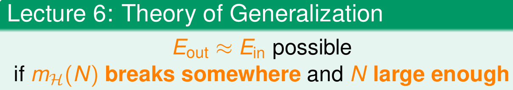

这节课介绍ML领域一个特别重要的概念，VC Dimension

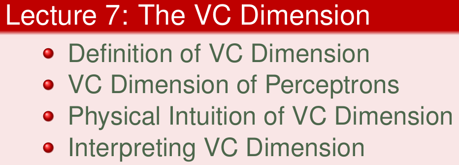

<!--more-->

## Definition of VC Dimension

由之前的课程我们知道，一个H，如果它有break point k的话，那它的growth func就是有界的。上界称为Bound function
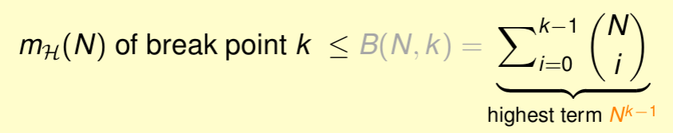

而Bound function也是有界的，且上界为N^(k-1)

从数据上看，N(k−1)比B(N,k)松弛很多

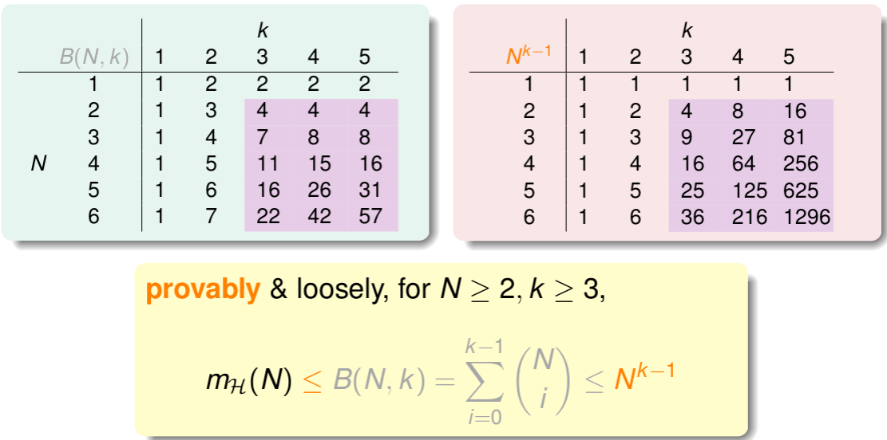

VC bound就可以转换为:

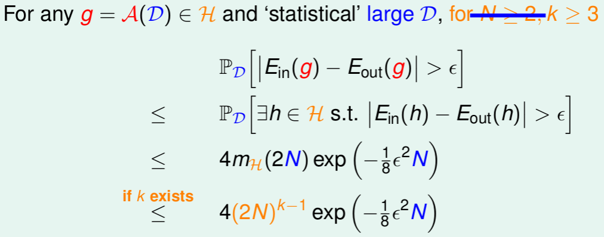

有结论:
1. 有break point k\
2. N 足够大
3. E_out ≈ E_in
4. 选择一个矩g，使E_in ≈ 0，即能够学习

### VC Dimension

就是最多能够分类的个数，也可以说shatter最多的inputs个数

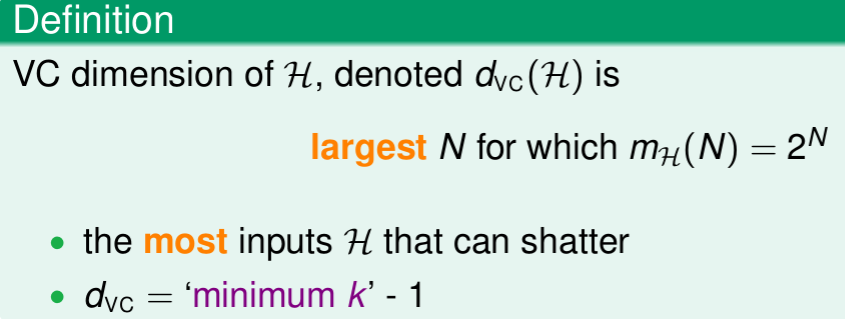

四种情况的VC Dimension

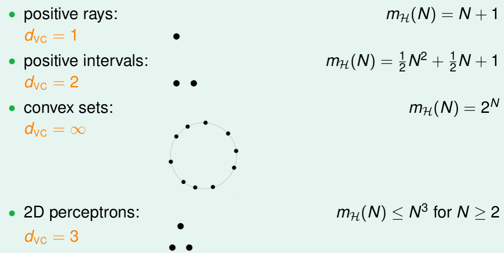

d_vc 代替 k，那么 VC bound 的问题也就转换为与 d_vc 和 N 相关了

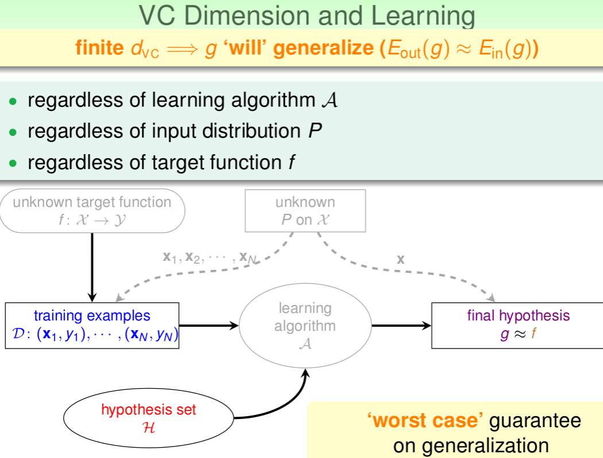

## VC Dimension of Perceptrons

这部分主要介绍d_vc = d+1

## Physical Intuition of VC Dimension

VD dimension 可以被当成是 H 的分类能力。

如图中W表示自由度

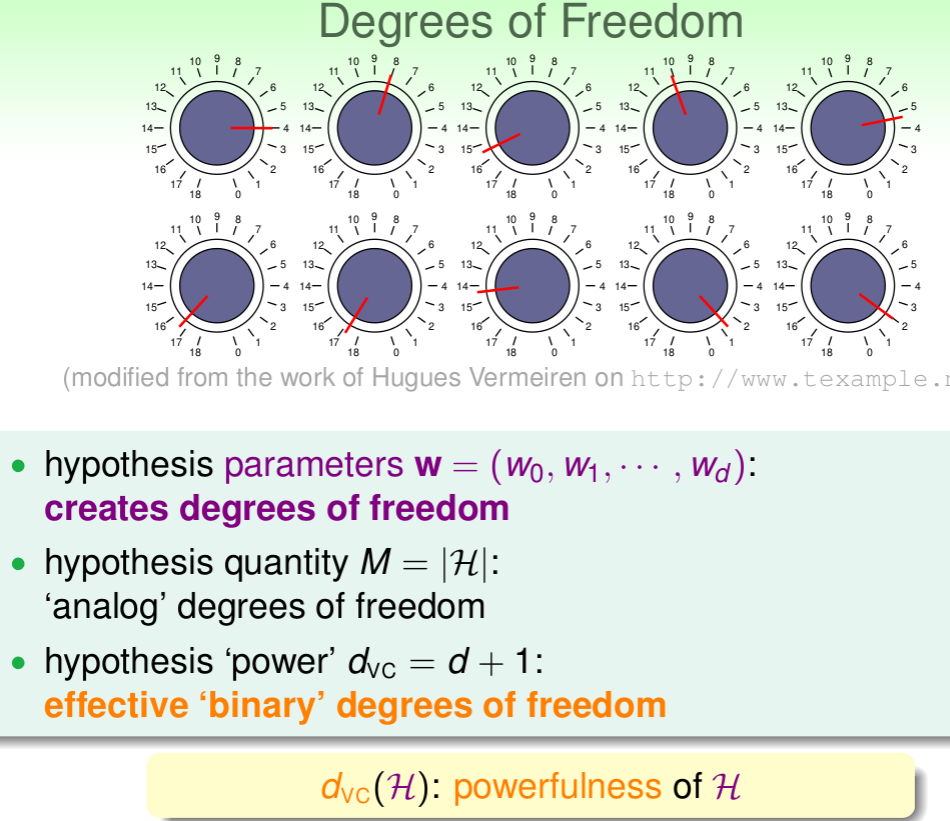

M 和 d_vc 的关系

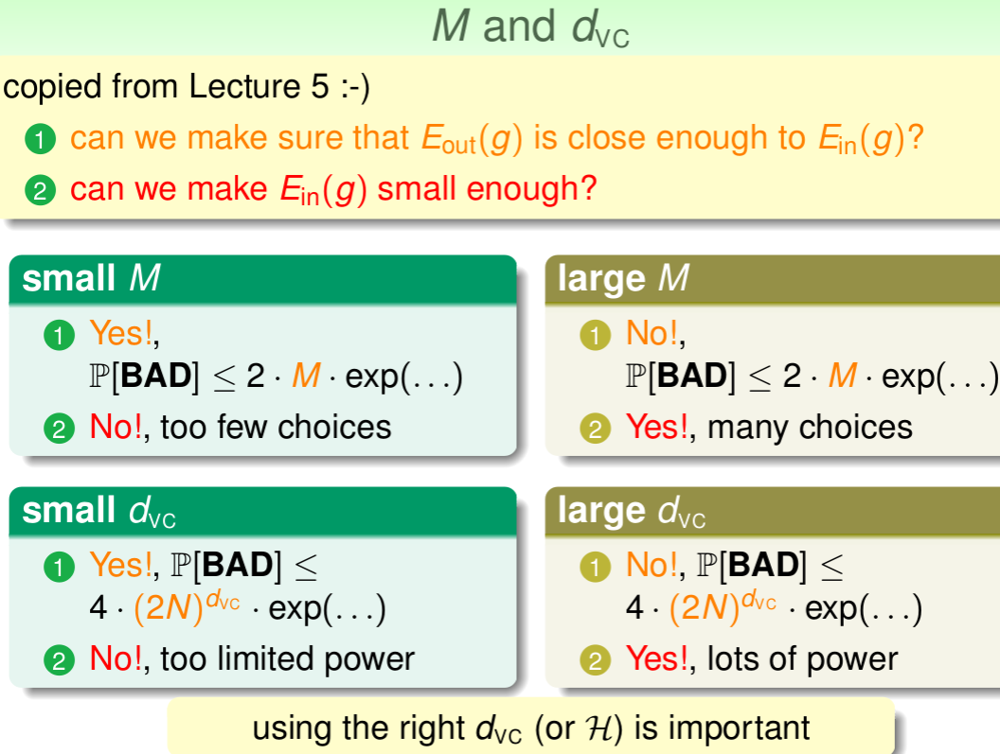

## Interpreting VC Dimension

深入地探讨VC Dimension的意义

重新推导

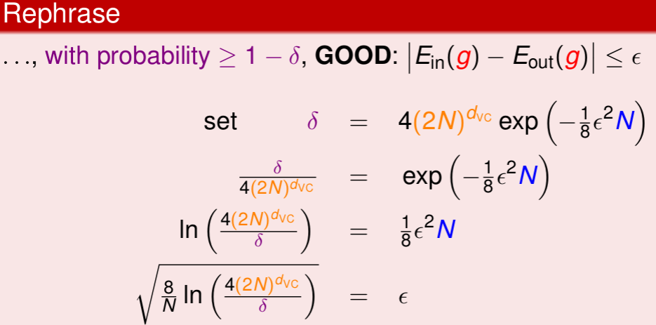

ϵ表现了假设空间H的泛化能力，ϵ越小，泛化能力越大。

推导出泛化误差 E_out 的边界

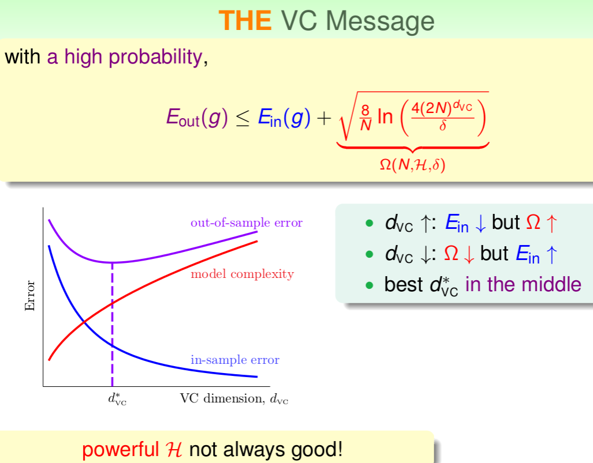

样本复杂度（Sample Complexity）

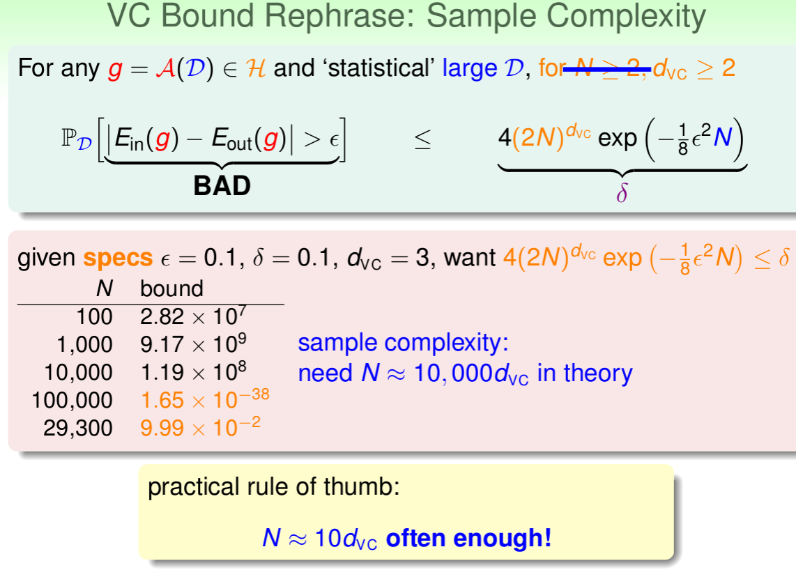

从实践来看，N ≈ 10 d_VC 就OK了

10倍的d_VC

VC Bound基本上对所有模型的宽松程度是基本一致的，所以，不同模型之间还是可以横向比较。

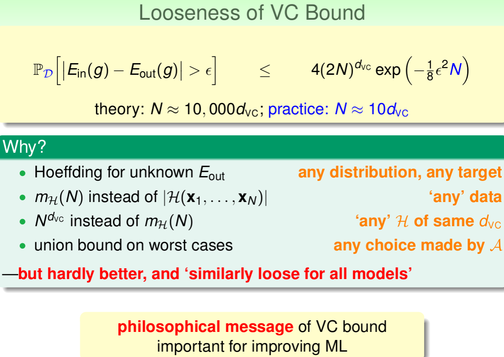

VC Bound宽松对ML的可行性还是没有太大影响

