上节课已经了解VC bound

本节课主要讨论 Noise and Error
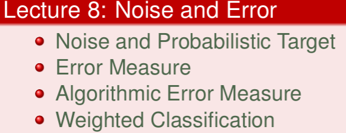

<!--more-->

## Noise and Probabilistic Target
回看ML的流程图
如果在里面存在 Noise，会发生什么？
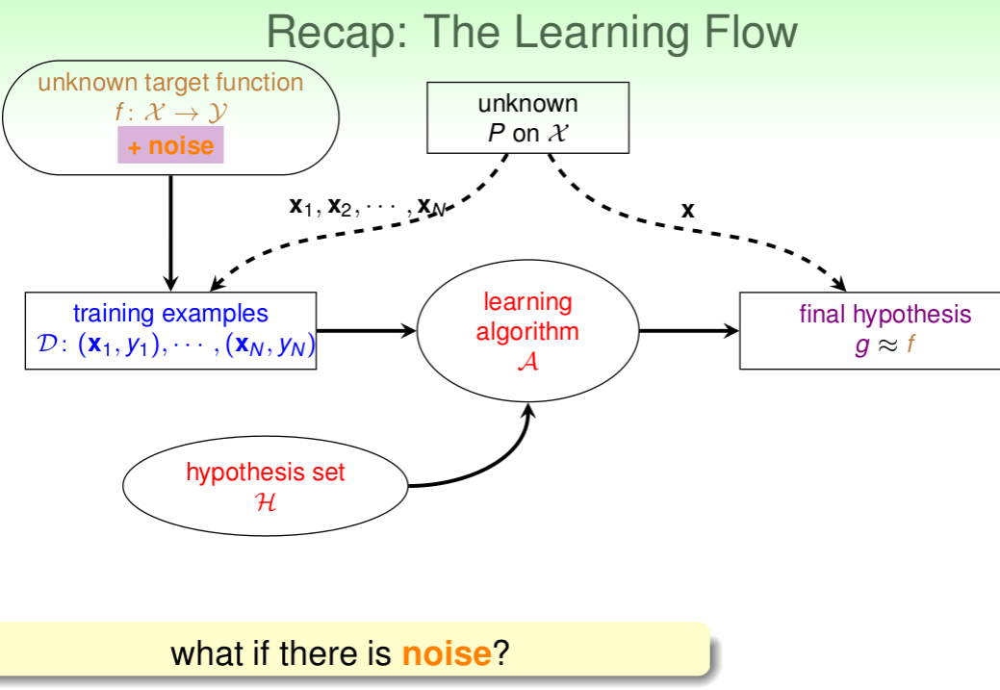

什么是noise呢？(以pocket算法举例)
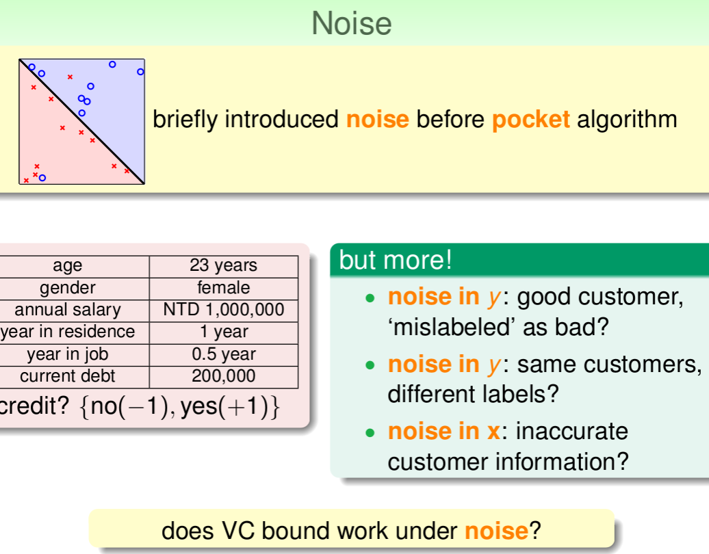

没有 Noise 的，我们称之为 deterministic
现在存在 Noise 的，被称为 probabilistic
 
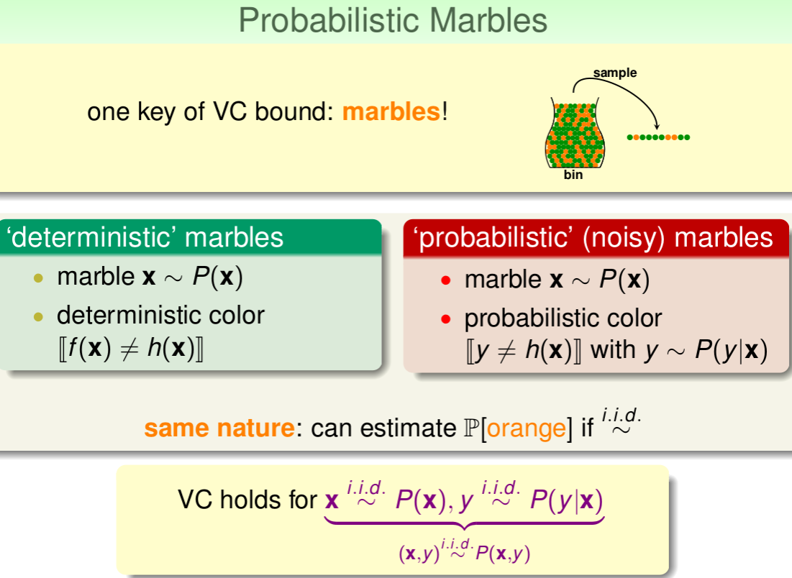

预测的分布

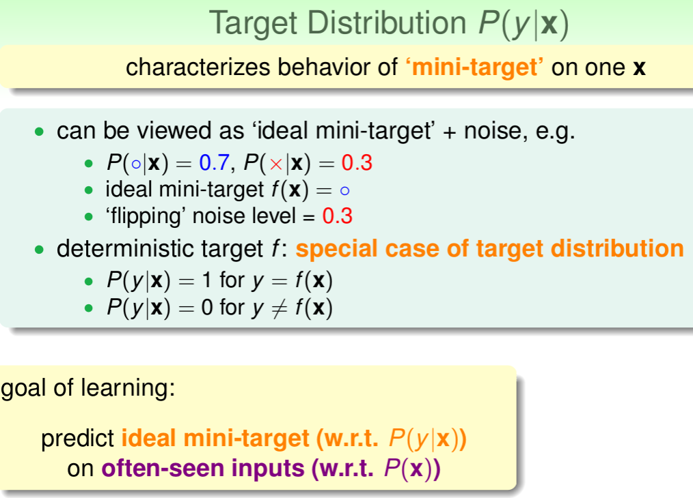

新的学习流程图
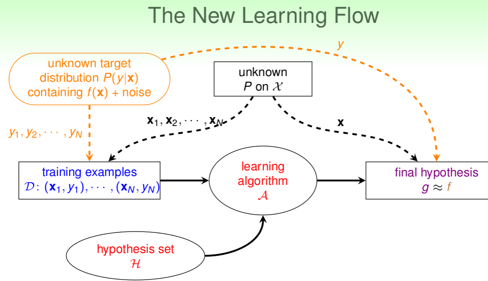

## Error Measure

主要方法:
1. out-of-sample：样本外的未知数据
1. pointwise：对每个数据点x进行测试
1. classification：看prediction与target是否一致，classification error通常称为0/1 error

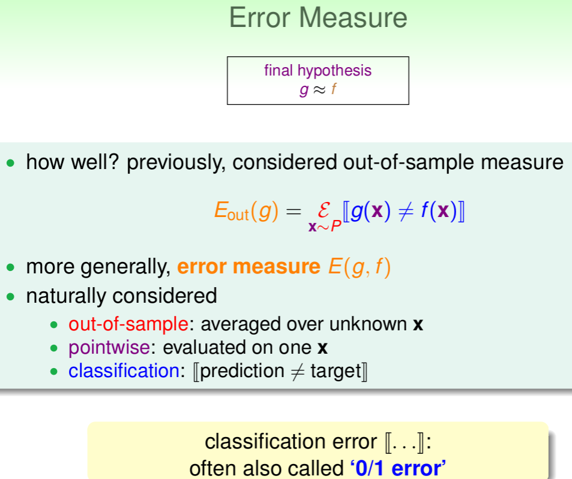

pointwise error实际上就是对数据集的每个点计算错误并计算平均

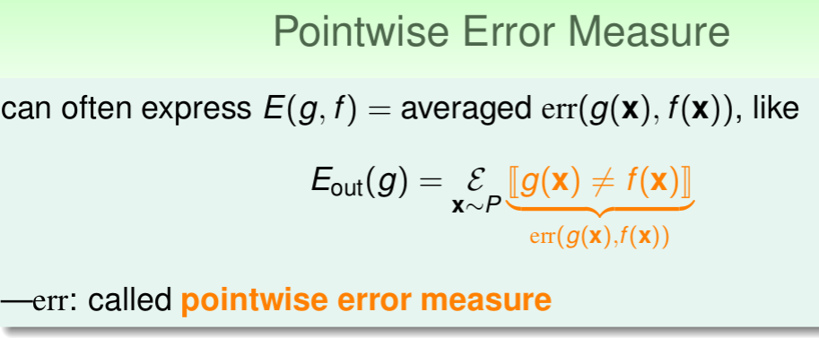

两种重要的 pointwise 方法
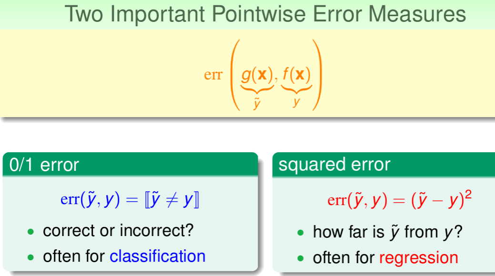

Ideal Mini-Target由P(y|x)P(y∣x)和err共同决定  

分别用0/1 error和squared error来估计最理想的mini-target是多少

使用不同的衡量方法会产生不同的结果

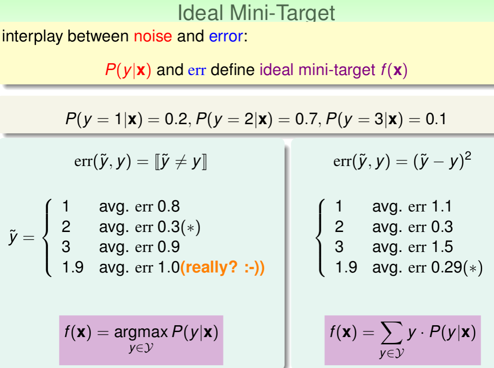

有error的学习流程图
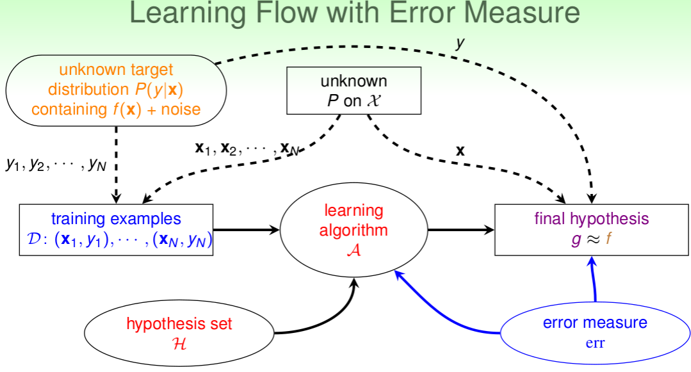

## Algorithmic Error Measure

Error有两种:
1. false accept,误把负类当成正类
2. false reject,误把正类当成负类

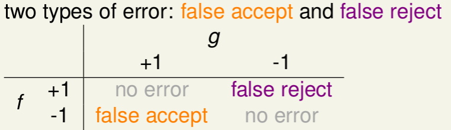

不同的机器学习问题，false accept和false reject应该有不同的权重

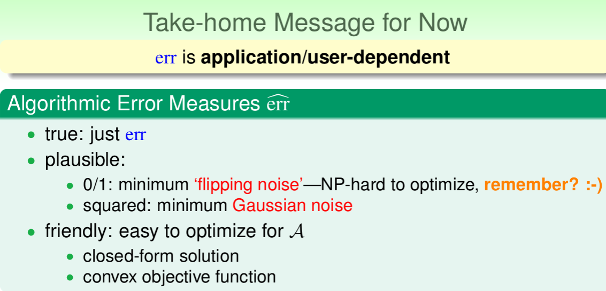

新的学习流程图
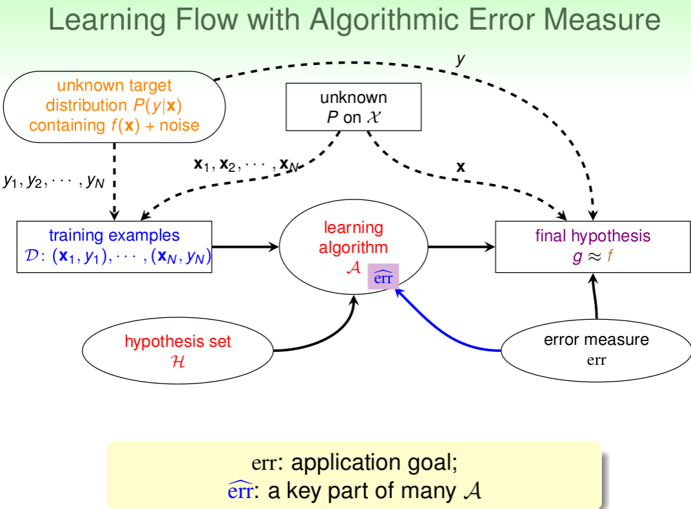

## Weighted Classification

ML的Cost Func源于这些error

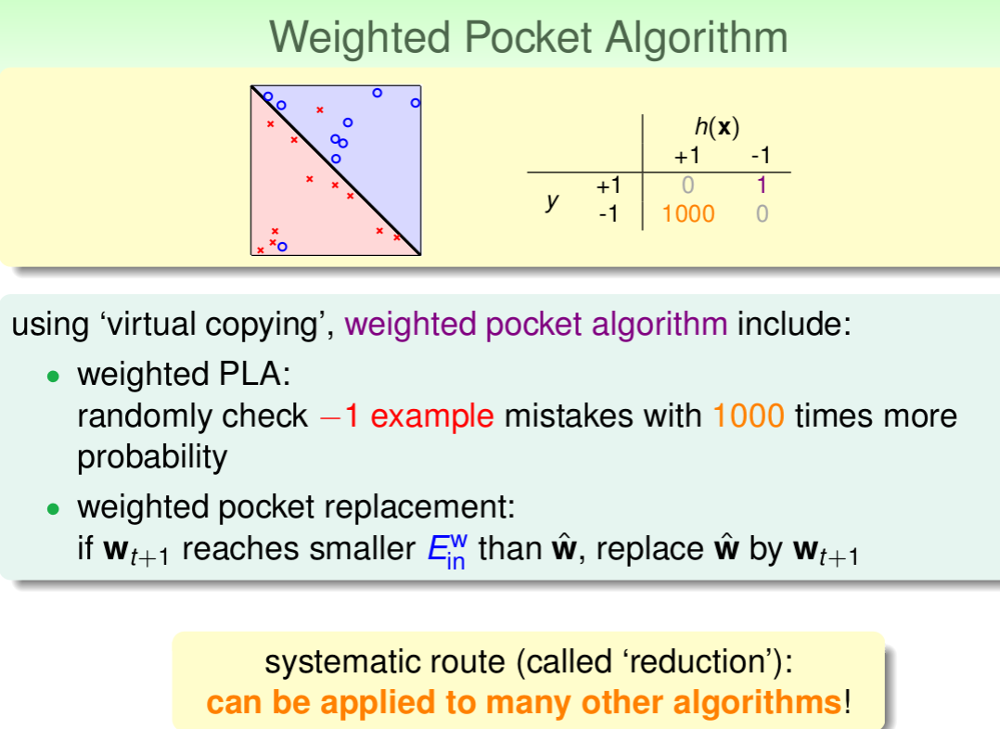

