之前有讨论到处理error的情况
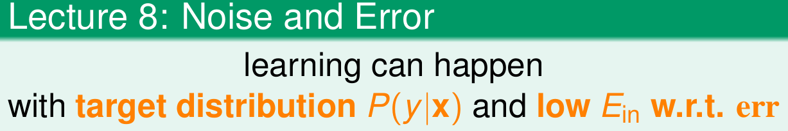

这节课主要讨论线性回归问题
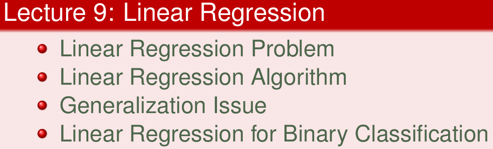
<!--more-->

## Linear Regression Problem
沿用之前的example，信用卡是否发放的问题

Linear Regression
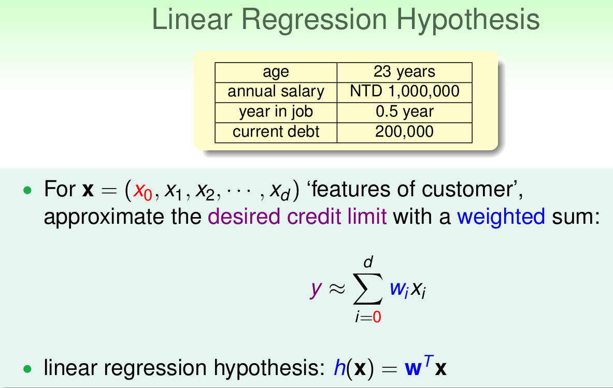

用户特征集为d维的X，加上常数项，维度为d+1，与权重ww的线性组合即为Hypothesis,记为h(x)

图示 Linear Regression
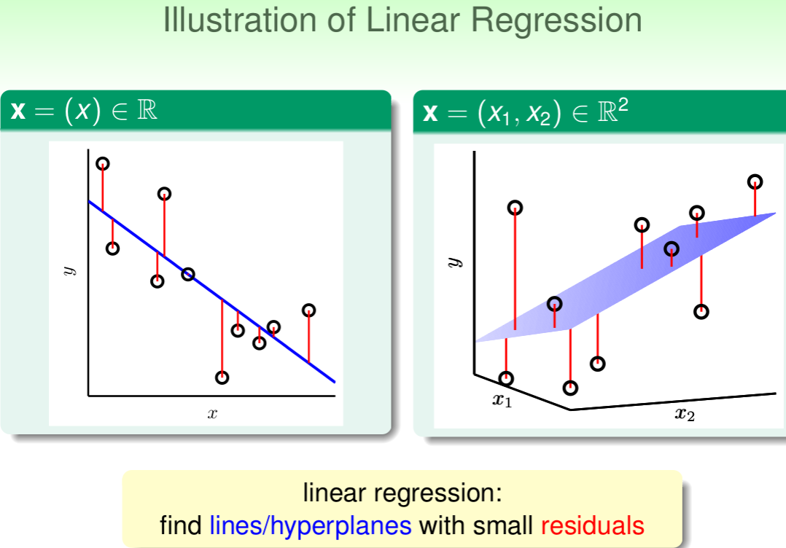

可以看出线性回归是找到直线(一维),平面(二维)使样本点与其差距(residuals)最小

Error Measure
使用上节课介绍的 squared error

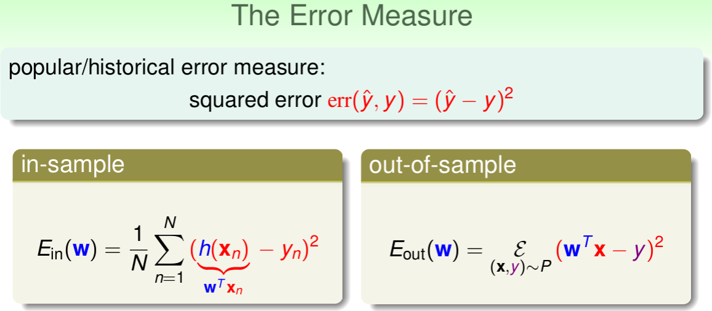

如何最小化 E_in(w) 呢？

## Linear Regression Algorithm

尝试将 E_in(w) 的公式表达成矩阵形式
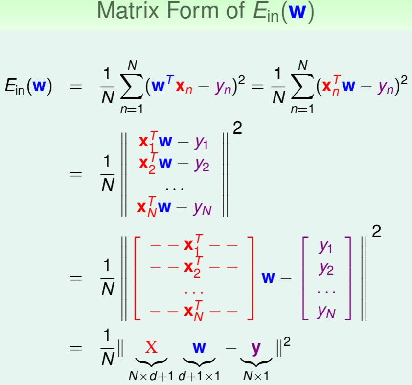

转换之后并查看，发现E_in(w)一般是个凸函数。凸函数的话，我们只要找到一阶导数等于零的位置，就找到了最优解
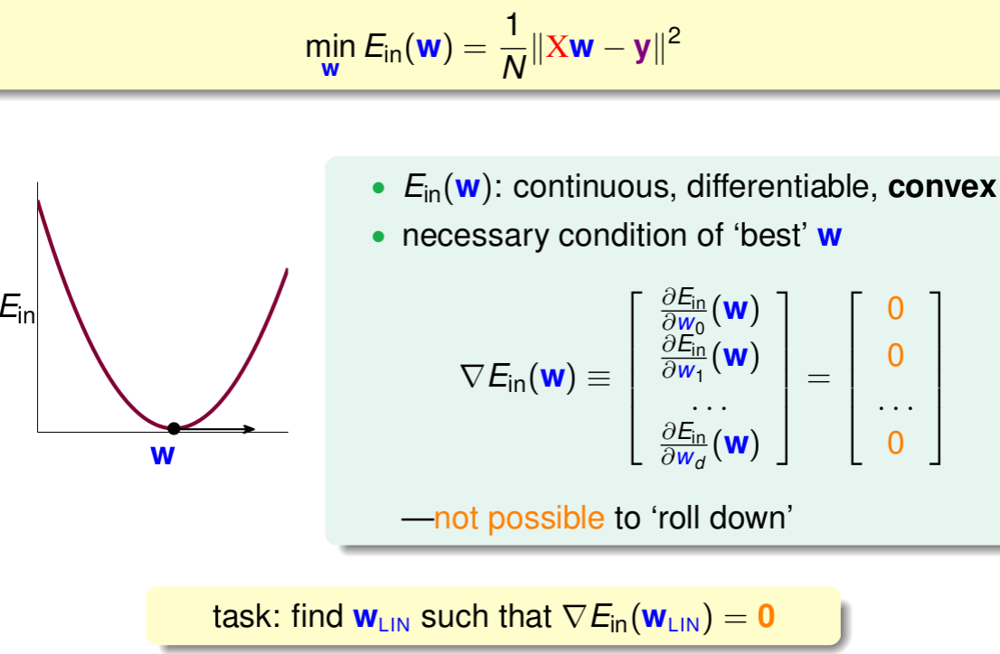

求梯度之后
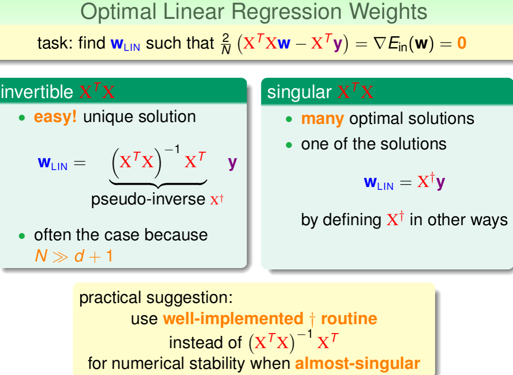

伪逆矩阵 pseudo-inverse，记为X^+，维度是(d+1)xN

一般情况下，只要满足样本数量N远大于样本特征维度d+1，就能保证矩阵的逆是存在的，称之为非奇异矩阵

而对于奇异矩阵，一般也会计算出一个也会计算出一个逆矩阵

可以看到 Algorithm 的大致流程
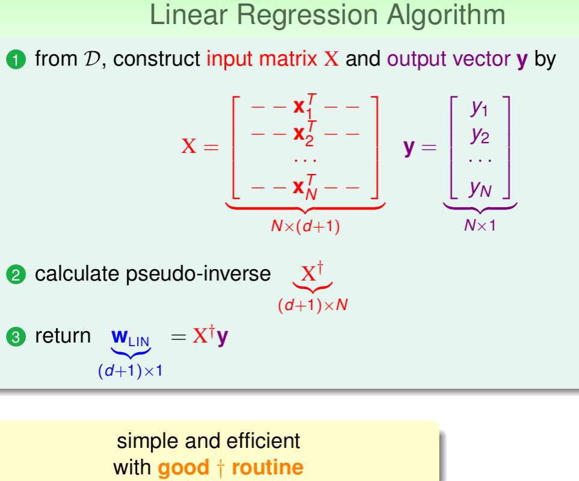

## Generalization Issue

看到这里，不免有个疑问

这线性回归问题算是ML算法么
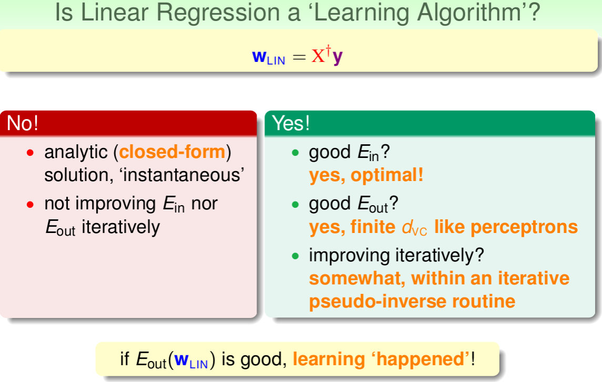

y是N维空间的一个向量，粉色区域表示输入矩阵X乘以不同权值向量w所构成的空间，根据所有w的取值，预测输出都被限定在粉色的空间中。向量y^就是粉色空间中的一个向量，代表预测的一种。y是实际样本数据输出值
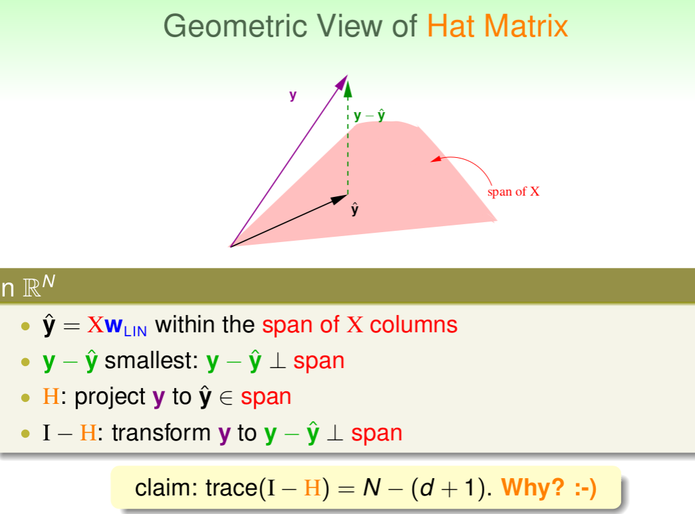

该I-H这种转换的物理意义：原来有一个有N个自由度的向量y，投影到一个有d+1维的空间x（代表一列的自由度，即单一输入样本的参数，如图中粉色区域），而余数剩余的自由度最大只有N-(d+1)种
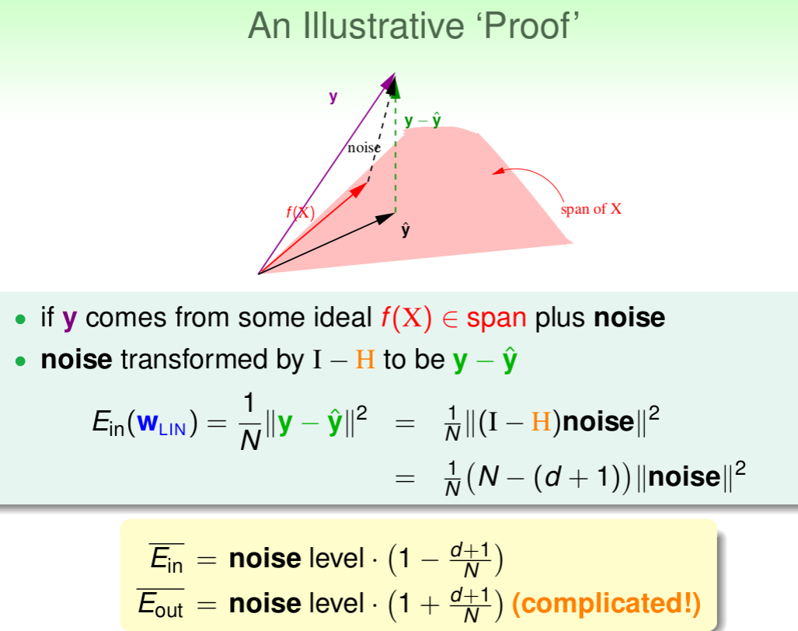

证明了当N足够大的时候，这种线性最小二乘法是可以进行机器学习的，算法有效
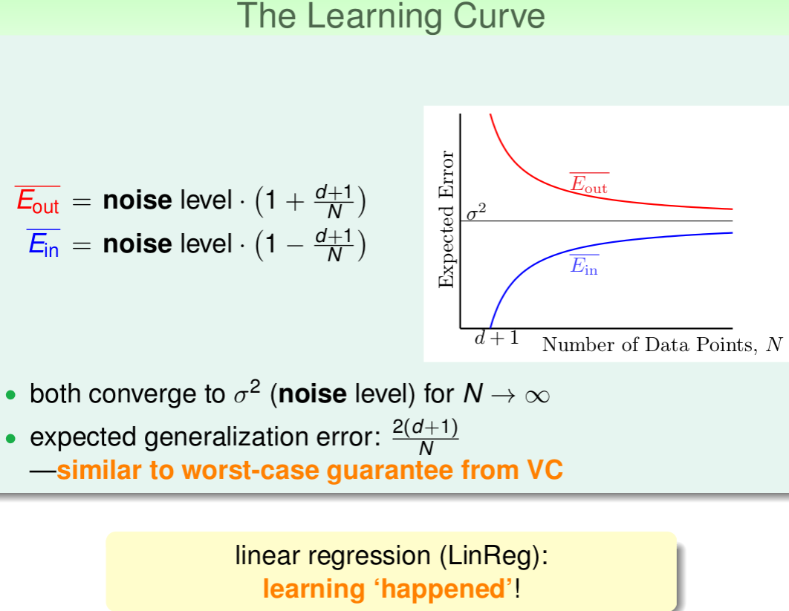

## Linear Regression for Binary Classification

比较线性分类和线性回归
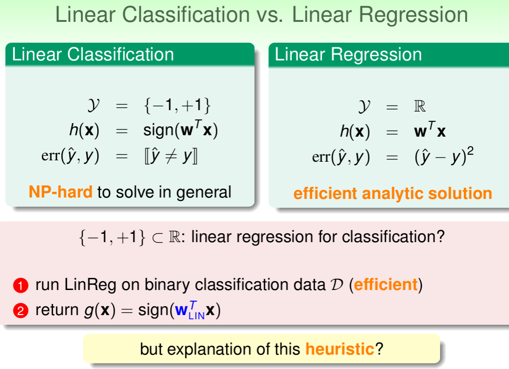

查看error情况
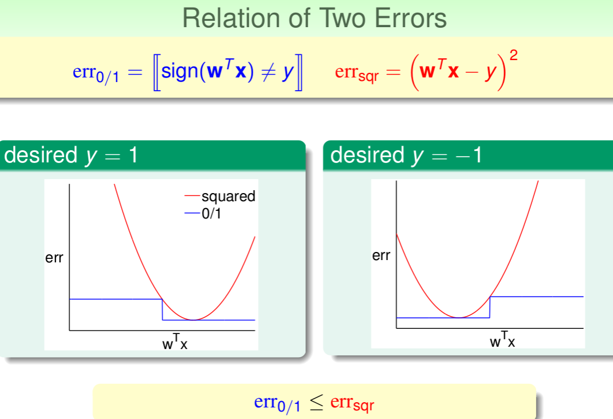

一般情况下，squared error曲线在0/1 error曲线之上。即err_{0/1} ≤ err_sqr
​
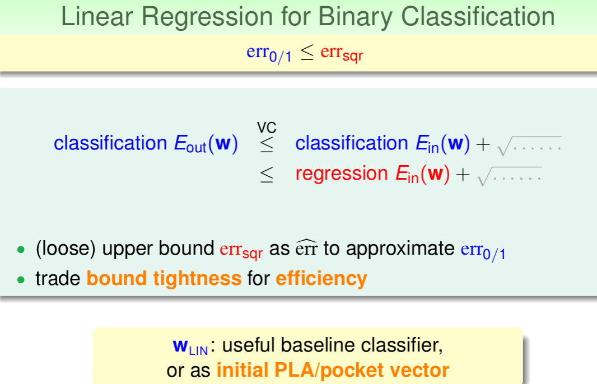

用err_{0/1}代替err_sqr,E_out仍然有上界，只不过是上界变得宽松了。也就是说用线性回归方法仍然可以解决线性分类问题，效果不会太差。二元分类问题得到了一个更宽松的上界，但是也是一种更有效率的求解方式