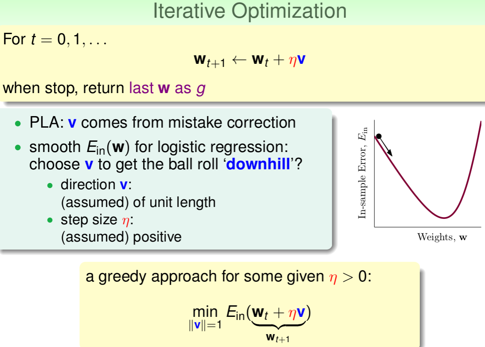

上节课讲到线性回归问题

这节课主要讨论逻辑回归问题

<!--more-->

## Logistic Regression Problem

这节课引入的是一个不同的问题，心脏病预测的问题：根据患者的个人信息，预测其是否会有心脏病。
这是一个二分类问题，其输出y只有{-1,1}两种情况

但是我们这里讨论的相对来说是一个概率问题，所以可以成为软性二分量

我们针对目标函数，给出 Hypothesis

怎么将s值限定在[0,1]之间呢？一个方法是使用sigmoid Function

## Logistic Regression Error

将Logistic Regression与之前讲的Linear Classification、Linear Regression做个比较

logistic regression的误差该如何定义

likelihood，是找到 hypothesis 中最接近 target function 的

将logistic function的表达式带入，那么minimize问题就会转化为如下形式

cross_entropy

## Gradient of Logistic Regression Error
根据之前Linear Regression的思路，我们只要计算 E_in 的梯度为零时的w，即为最优解

但是不同与线性回归的是，这个不是 closed-form 的

需要逐步计算才行

w每次更新包含两个内容：一个是每次更新的方向，另一个是每次更新的步长η
参数(v,\eta)(v,η)和终止条件决定了我们的迭代优化算法。

## Gradient Descent

迭代优化让每次w都有更新

梯度下降

η如果太小的话，那么下降的速度就会很慢  
η如果太大的话，那么之前利用Taylor展开的方法就不准了，造成下降很不稳定，甚至会上升  
需要选择正确的η  

最后
